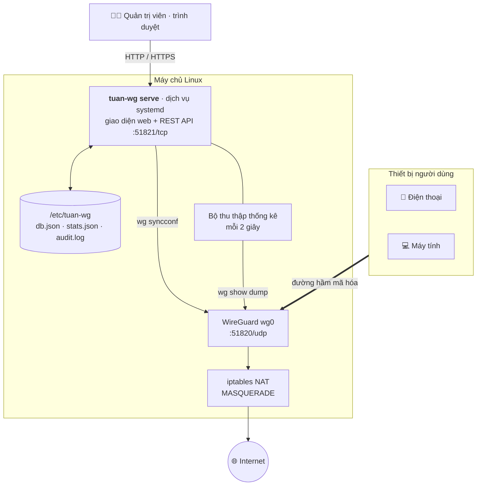

<div align="center">


# Tuấn WireGuard

**Giao diện web tiếng Việt để cài đặt và quản lý máy chủ VPN WireGuard**

Gọn nhẹ · Viết bằng C · Một file chạy duy nhất (~730 KB) · Tự khởi động cùng máy chủ

[](https://github.com/tlearnvn/tuan-wg/actions/workflows/ci.yml)
[](https://github.com/tlearnvn/tuan-wg/releases)
[](#cài-đặt-nhanh)
[](src/)
[](LICENSE)

[Tính năng](#tính-năng) · [Hình ảnh](#hình-ảnh) · [Cài đặt](#cài-đặt-nhanh) · [Hướng dẫn chi tiết](docs/HUONG-DAN-SU-DUNG.md) · [Dòng lệnh](#dòng-lệnh) · [Nhật ký thay đổi](CHANGELOG.md)

</div>


**Tuấn WireGuard** biến một máy chủ Linux bất kỳ thành máy chủ VPN WireGuard chỉ với **một lệnh cài đặt**, sau đó
mọi việc — thêm người dùng, xuất mã QR, theo dõi dung lượng, đặt hạn mức — đều làm trên **giao diện web tiếng Việt**
đẹp, nhanh, dùng tốt cả trên điện thoại. Toàn bộ ứng dụng (máy chủ web, REST API, giao diện, font chữ) nằm gọn
trong **một file thực thi tĩnh viết bằng C**, không cần Node.js, Python, Docker hay cơ sở dữ liệu.

> 📘 **Hướng dẫn sử dụng đầy đủ** (có hình minh họa từng màn hình, sơ đồ hoạt động, xử lý sự cố):
> [**docs/HUONG-DAN-SU-DUNG.md**](docs/HUONG-DAN-SU-DUNG.md)

## Tính năng

**👥 Quản lý người dùng VPN**
- Thêm, sửa, xóa, **bật/tắt tức thì** — áp dụng bằng `wg syncconf` nên **không làm rớt kết nối** của người khác
- Tìm kiếm, lọc (online, offline, đã khóa, có giới hạn), sắp xếp, **thao tác hàng loạt**
- Tùy chọn riêng từng người: IP cố định, định tuyến (toàn bộ / chỉ mạng VPN / tùy chỉnh), DNS, Keepalive, MTU, PresharedKey, tạo lại khóa

**📲 Xuất cấu hình**
- **Mã QR** để quét bằng ứng dụng WireGuard, tải file **`.conf`**, tải **tất cả dạng `.zip`**
- **Link chia sẻ có thời hạn** (1 giờ – 7 ngày): người dùng tự mở link để quét QR / tải cấu hình mà **không cần tài khoản**, thu hồi bất cứ lúc nào
- Hướng dẫn kết nối có sẵn cho **Android, iPhone/iPad, Windows, macOS, Linux**

**📊 Thống kê dung lượng**
- Băng thông **thời gian thực** (cập nhật mỗi 2 giây), trạng thái online, IP thật của thiết bị, lần kết nối gần nhất
- Theo giờ / ngày / tháng, xem 24 giờ → 12 tháng, **xếp hạng người dùng**, **xuất CSV**
- **Hạn mức dung lượng** (tổng hoặc làm mới mỗi tháng) và **ngày hết hạn** — tự khóa khi vượt, tự mở khi gia hạn hoặc sang tháng mới

**🔒 Bảo mật**
- Mật khẩu băm **PBKDF2-SHA256** (210.000 vòng), **xác thực 2 lớp TOTP** (Google Authenticator, Authy…)
- Chặn dò mật khẩu, chống CSRF, cookie `HttpOnly` + `SameSite=Strict`, Content-Security-Policy
- Quản lý & đăng xuất phiên từ xa, **nhật ký hoạt động** đầy đủ

**⚙️ Vận hành**
- **Cài đặt một lệnh**: tự cài gói, bật IP forwarding, cấu hình NAT/tường lửa, **tạo dịch vụ systemd tự khởi động cùng máy chủ**
- Nhập cấu hình WireGuard có sẵn; tự dùng `wireguard-go` khi kernel không có WireGuard
- **Sao lưu & khôi phục** bằng một file JSON; **dòng lệnh đầy đủ** (in mã QR ngay trên terminal)
- Giao diện **sáng / tối**, tương thích **điện thoại**; **chế độ demo** để xem thử
- **Phiên bản tự tăng + CHANGELOG tự ghi** mỗi khi mã nguồn thay đổi; CI và phát hành tự động

## Hình ảnh

<table>
<tr>
<td width="50%" valign="top"><br><sub><b>Người dùng</b> — trạng thái online, tốc độ, dung lượng, hạn mức, thời hạn</sub></td>
<td width="50%" valign="top"><br><sub><b>Kết nối thiết bị</b> — quét mã QR hoặc tải file <code>.conf</code></sub></td>
</tr>
<tr>
<td valign="top"><br><sub><b>Thêm người dùng</b> — thời hạn sử dụng, hạn mức dung lượng</sub></td>
<td valign="top"><br><sub><b>Link chia sẻ</b> — gửi qua Zalo/Messenger, tự hết hạn, thu hồi được</sub></td>
</tr>
<tr>
<td valign="top"><br><sub><b>Thống kê</b> — lưu lượng theo ngày và xếp hạng người dùng</sub></td>
<td valign="top"><br><sub><b>Cài đặt máy chủ</b> — endpoint, cổng, dải IP, DNS, NAT, múi giờ</sub></td>
</tr>
<tr>
<td valign="top"><br><sub><b>Nhật ký hoạt động</b> — đăng nhập, thao tác quản trị, tự khóa/mở khóa</sub></td>
<td valign="top"><br><sub><b>Chế độ tối</b> — tự theo hệ điều hành hoặc bật bằng một nút</sub></td>
</tr>
</table>

<table>
<tr>
<td width="25%" valign="top"><br><sub>Tổng quan</sub></td>
<td width="25%" valign="top"><br><sub>Người dùng</sub></td>
<td width="25%" valign="top"><br><sub>Mã QR</sub></td>
<td width="25%" valign="top"><br><sub>Menu</sub></td>
</tr>
</table>

## Cài đặt nhanh

> **Yêu cầu:** máy chủ Linux **amd64** (Debian 11/12/13, Ubuntu 20.04/22.04/24.04 hoặc bản tương tự), quyền `root`,
> và **mở cổng `51820/udp`** (WireGuard) + **`51821/tcp`** (giao diện web) trên tường lửa của nhà cung cấp VPS.

### Cách 1 — Một lệnh (khuyên dùng)

```bash
curl -fsSL https://raw.githubusercontent.com/tlearnvn/tuan-wg/HEAD/scripts/install.sh | sudo bash
```

Tự tải bản mới nhất trên [GitHub Releases](https://github.com/tlearnvn/tuan-wg/releases) (chưa có bản phát hành thì tự build từ mã nguồn),
cài WireGuard + giao diện web + dịch vụ tự khởi động.
Muốn đặt sẵn tên miền / cổng: `curl -fsSL …/install.sh | sudo TUAN_WG_ARGS="-y --endpoint vpn.tenmien.vn" bash`.

### Cách 2 — Gói `.deb` (Debian / Ubuntu)

Tải từ [GitHub Releases](https://github.com/tlearnvn/tuan-wg/releases) (khi đã có bản phát hành) hoặc dùng file `.deb` bạn có sẵn:

```bash
wget https://github.com/tlearnvn/tuan-wg/releases/latest/download/tuan-wg_amd64.deb
sudo apt install ./tuan-wg_amd64.deb
```

`apt` tự cài `wireguard-tools`, `iptables`, `iproute2`; cài xong màn hình in ra địa chỉ web và mật khẩu quản trị.

### Cách 3 — Bản `.tar.gz` (mọi bản Linux amd64)

```bash
wget https://github.com/tlearnvn/tuan-wg/releases/latest/download/tuan-wg-linux-amd64.tar.gz
tar xzf tuan-wg-linux-amd64.tar.gz && cd tuan-wg-*-linux-amd64
sudo ./install.sh            # thêm tùy chọn nếu muốn, ví dụ: sudo ./install.sh -y --web-port 8443
```

### Cách 4 — Build từ mã nguồn

```bash
sudo apt install build-essential musl-tools git
git clone https://github.com/tlearnvn/tuan-wg.git && cd tuan-wg
make static                             # tạo build/static/tuan-wg (binary tĩnh)
sudo ./build/static/tuan-wg install
```

Kết quả sau khi cài — ghi lại **địa chỉ web** và **mật khẩu** được in ra:


## Bắt đầu sử dụng

1. **Đăng nhập** tại `http://IP-máy-chủ:51821` bằng tài khoản `admin` và mật khẩu vừa in ra (quên thì chạy `sudo tuan-wg passwd`).
2. **Kiểm tra Endpoint** ở *Cài đặt → WireGuard*: tên miền hoặc IP công khai mà thiết bị sẽ kết nối tới (trình cài đặt đã tự phát hiện).
3. **Thêm người dùng**: bấm **Thêm người dùng**, đặt tên, chọn thời hạn / hạn mức nếu cần.
4. **Kết nối thiết bị**: quét **mã QR** bằng ứng dụng WireGuard, tải **file `.conf`**, hoặc gửi **link chia sẻ**.
5. **Theo dõi** trạng thái online và dung lượng ở *Tổng quan* và *Thống kê*.

Chi tiết từng màn hình, từng tùy chọn: xem [**Hướng dẫn sử dụng**](docs/HUONG-DAN-SU-DUNG.md).

## Cách hoạt động



- **`tuan-wg serve`** chạy nền dưới dạng dịch vụ systemd `tuan-wg.service` (tự khởi động cùng máy, tự chạy lại khi lỗi),
  phục vụ giao diện web được **nhúng sẵn trong binary** và REST API.
- Mỗi thay đổi (thêm/tắt người dùng…) được ghi vào `/etc/tuan-wg/db.json`, sinh lại `/etc/wireguard/wg0.conf`
  rồi áp dụng nóng bằng `wg syncconf` — các kết nối khác **không bị gián đoạn**.
- Bộ thu thập đọc `wg show dump` mỗi 2 giây để tính tốc độ, dung lượng theo giờ/ngày/tháng, trạng thái online
  và tự khóa người dùng hết hạn / vượt hạn mức.
- WireGuard chạy độc lập (`wg-quick@wg0`): kể cả khi dừng giao diện web, VPN **vẫn hoạt động bình thường**.

## Dòng lệnh

| Lệnh | Tác dụng |
|---|---|
| `sudo tuan-wg install` | Cài đặt / cấu hình (xem `tuan-wg install --help` để biết các tùy chọn) |
| `sudo tuan-wg status` | Trạng thái dịch vụ web, WireGuard, số người dùng, địa chỉ truy cập |
| `sudo tuan-wg client list` | Danh sách người dùng |
| `sudo tuan-wg client add "Tên" --expire 30 --limit 50 --monthly --qr` | Thêm người dùng (30 ngày, 50 GB/tháng) và in mã QR ra terminal |
| `sudo tuan-wg client show "Tên" --qr` | Xem cấu hình + mã QR |
| `sudo tuan-wg client config "Tên" > ten.conf` | Xuất file cấu hình |
| `sudo tuan-wg client enable \| disable \| del "Tên"` | Bật / tắt / xóa người dùng |
| `sudo tuan-wg passwd` | Đặt lại mật khẩu quản trị (`--random` để tạo ngẫu nhiên) |
| `sudo tuan-wg reset-2fa` | Tắt xác thực 2 lớp khi mất điện thoại |
| `sudo tuan-wg backup ban-sao-luu.json` | Sao lưu toàn bộ dữ liệu |
| `sudo tuan-wg restore ban-sao-luu.json` | Khôi phục (ví dụ khi chuyển sang máy chủ mới) |
| `sudo tuan-wg service status \| restart \| logs` | Quản lý dịch vụ systemd |
| `sudo tuan-wg uninstall [--purge]` | Gỡ cài đặt (`--purge`: xóa luôn dữ liệu) |

<table>
<tr>
<td width="50%" valign="top"></td>
<td width="50%" valign="top"></td>
</tr>
</table>

## Bảo mật khuyến nghị

- **Đổi mật khẩu** sau lần đăng nhập đầu và **bật xác thực 2 lớp** (*Cài đặt → Tài khoản & bảo mật*).
- Dùng **HTTPS**: đặt giao diện web sau Caddy/Nginx. Ví dụ với [Caddy](https://caddyserver.com) (tự lấy chứng chỉ Let's Encrypt):
  ```caddyfile
  quantri.tenmien.vn {
      reverse_proxy 127.0.0.1:51821
  }
  ```
  rồi đổi *Địa chỉ lắng nghe* thành `127.0.0.1` để không ai truy cập trực tiếp cổng 51821.
- Hoặc **chỉ cho vào trang quản trị khi đã kết nối VPN** (lắng nghe `10.8.0.1`), hay dùng đường hầm SSH:
  `ssh -L 51821:127.0.0.1:51821 root@IP-máy-chủ` rồi mở `http://localhost:51821`.

Chi tiết (Nginx, tường lửa, sơ đồ các cách truy cập): [Hướng dẫn → Bảo mật nâng cao](docs/HUONG-DAN-SU-DUNG.md#13-bảo-mật-nâng-cao).

## Cập nhật và gỡ cài đặt

```bash
# Cập nhật lên bản mới nhất (giữ nguyên người dùng, cài đặt, thống kê)
curl -fsSL https://raw.githubusercontent.com/tlearnvn/tuan-wg/HEAD/scripts/install.sh | sudo bash

# Gỡ bản .deb: remove giữ dữ liệu, purge xóa sạch
sudo apt remove tuan-wg
sudo apt purge tuan-wg

# Gỡ bản .tar.gz / build từ mã nguồn
sudo tuan-wg uninstall            # giữ dữ liệu ở /etc/tuan-wg
sudo tuan-wg uninstall --purge    # xóa luôn dữ liệu và cấu hình WireGuard do ứng dụng tạo
```

## Phát triển

```bash
make              # build bản phát triển: build/tuan-wg
make test         # kiểm thử đơn vị (AddressSanitizer + UBSan)
make check        # kiểm thử đơn vị + REST API
make demo         # xem thử giao diện với dữ liệu mẫu: http://127.0.0.1:51821 (admin / admin)
make deb dist     # đóng gói .deb và .tar.gz vào dist/
```

| Thư mục | Nội dung |
|---|---|
| [`src/`](src) | Mã nguồn C: máy chủ HTTP, REST API, điều khiển WireGuard, thống kê, mật mã (SHA-256, PBKDF2, X25519, TOTP), mã QR, trình cài đặt |
| [`web/`](web) | Giao diện web (HTML/CSS/JavaScript thuần), được nhúng vào binary khi build |
| [`packaging/`](packaging) | Dịch vụ systemd, trang man, đóng gói `.deb` / `.tar.gz` |
| [`scripts/`](scripts) | Trình cài đặt một lệnh, tự tăng phiên bản, chụp ảnh tài liệu |
| [`tests/`](tests) | Kiểm thử đơn vị, REST API, fuzz HTTP, kiểm thử đầu-cuối với WireGuard thật |
| [`docs/`](docs) | Hướng dẫn sử dụng và hình minh họa |

**Phiên bản tự động:** commit theo [Conventional Commits](https://www.conventionalcommits.org/vi/v1.0.0/)
(`feat:` → tăng minor, `fix:` → tăng patch, `feat!:` → tăng major). Sau mỗi commit có thay đổi mã nguồn, git hook
`.githooks/post-commit` tự tăng `VERSION` và ghi mục mới vào [`CHANGELOG.md`](CHANGELOG.md); khi mã nguồn được đưa lên
nhánh `main`, GitHub Actions tự gắn tag và phát hành gói cài đặt. Bật hook một lần sau khi clone: `scripts/setup-hooks.sh`.
Xem chi tiết ở [Hướng dẫn → Dành cho nhà phát triển](docs/HUONG-DAN-SU-DUNG.md#19-dành-cho-nhà-phát-triển).

## Giấy phép

Phát hành theo giấy phép [MIT](LICENSE) — © 2026 **Tuandethuong**.

Sử dụng: [QR Code generator library](https://www.nayuki.io/page/qr-code-generator-library) của Project Nayuki (MIT),
thuật toán X25519 dựa trên [TweetNaCl](https://tweetnacl.cr.yp.to/) (public domain), font
[Be Vietnam Pro](https://github.com/bettergui/BeVietnamPro) (SIL Open Font License 1.1).
*WireGuard* là nhãn hiệu đã đăng ký của Jason A. Donenfeld; dự án này không liên kết với dự án WireGuard.

<div align="center"><sub>Được viết với ❤️ bởi <b>Tuandethuong</b></sub></div>
