<div align="center">


# Hướng dẫn sử dụng Tuấn WireGuard

Hướng dẫn đầy đủ từ cài đặt, tạo người dùng, kết nối thiết bị đến bảo mật, sao lưu và xử lý sự cố.
Áp dụng cho phiên bản **1.x** · Tác giả **Tuandethuong** · [Quay lại trang chính](../README.md)

</div>

---

## Mục lục

1. [Giới thiệu và cách hoạt động](#1-giới-thiệu-và-cách-hoạt-động)
2. [Yêu cầu hệ thống](#2-yêu-cầu-hệ-thống)
3. [Cài đặt](#3-cài-đặt)
4. [Đăng nhập lần đầu](#4-đăng-nhập-lần-đầu)
5. [Trang Tổng quan](#5-trang-tổng-quan)
6. [Quản lý người dùng](#6-quản-lý-người-dùng)
7. [Thống kê dung lượng](#7-thống-kê-dung-lượng)
8. [Nhật ký hoạt động](#8-nhật-ký-hoạt-động)
9. [Cài đặt](#9-cài-đặt)
10. [Dùng trên điện thoại và chế độ tối](#10-dùng-trên-điện-thoại-và-chế-độ-tối)
11. [Dòng lệnh](#11-dòng-lệnh)
12. [Dịch vụ tự khởi động (systemd)](#12-dịch-vụ-tự-khởi-động-systemd)
13. [Bảo mật nâng cao](#13-bảo-mật-nâng-cao)
14. [Sao lưu, khôi phục và chuyển máy chủ](#14-sao-lưu-khôi-phục-và-chuyển-máy-chủ)
15. [Cập nhật và gỡ cài đặt](#15-cập-nhật-và-gỡ-cài-đặt)
16. [Xử lý sự cố và câu hỏi thường gặp](#16-xử-lý-sự-cố-và-câu-hỏi-thường-gặp)
17. [Tệp tin và thư mục](#17-tệp-tin-và-thư-mục)
18. [REST API](#18-rest-api)
19. [Dành cho nhà phát triển](#19-dành-cho-nhà-phát-triển)

---

## 1. Giới thiệu và cách hoạt động

[WireGuard](https://www.wireguard.com) là giao thức VPN hiện đại: nhanh, mã hóa mạnh, cấu hình gọn. Tuy nhiên
quản lý WireGuard "thuần" nghĩa là tự sinh khóa, tự sửa file cấu hình, tự tính IP cho từng thiết bị và không có
thống kê. **Tuấn WireGuard** lo toàn bộ phần đó qua giao diện web tiếng Việt:

- **Cài đặt** WireGuard, NAT, tường lửa và dịch vụ tự khởi động bằng một lệnh.
- **Quản lý người dùng**: mỗi người dùng (một thiết bị) có cặp khóa, IP và file cấu hình riêng.
- **Xuất cấu hình** dạng mã QR / file `.conf` / link chia sẻ có thời hạn.
- **Thống kê** tốc độ, dung lượng theo thời gian thực và theo giờ / ngày / tháng; **tự khóa** khi hết hạn hoặc vượt hạn mức.

### Kiến trúc

Toàn bộ ứng dụng là **một file thực thi** `tuan-wg` viết bằng C. Giao diện web (HTML/CSS/JavaScript, font chữ)
được nhúng sẵn bên trong nên không cần máy chủ web, Node.js hay cơ sở dữ liệu riêng.

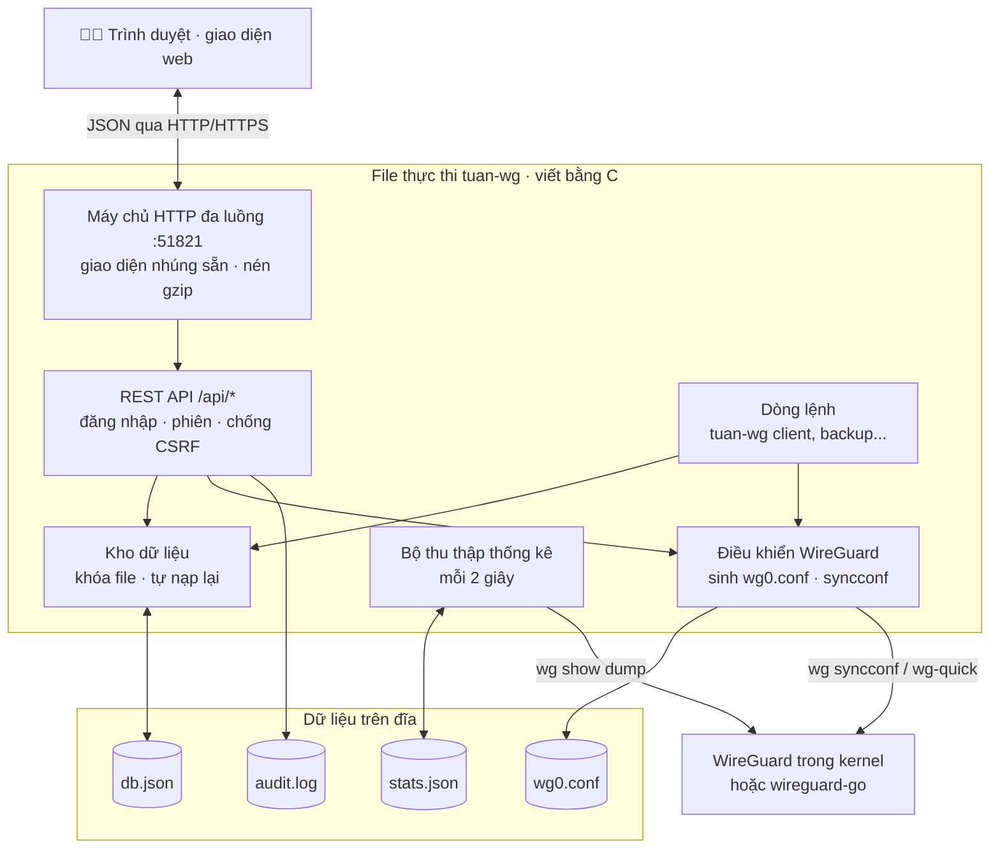
```mermaid
flowchart TB
    ui["🧑‍💻 Trình duyệt · giao diện web"]
    subgraph bin["File thực thi tuan-wg · viết bằng C"]
        http["Máy chủ HTTP đa luồng :51821<br/>giao diện nhúng sẵn · nén gzip"]
        api["REST API /api/*<br/>đăng nhập · phiên · chống CSRF"]
        cli["Dòng lệnh<br/>tuan-wg client, backup..."]
        store["Kho dữ liệu<br/>khóa file · tự nạp lại"]
        wgctl["Điều khiển WireGuard<br/>sinh wg0.conf · syncconf"]
        collector["Bộ thu thập thống kê<br/>mỗi 2 giây"]
    end
    subgraph disk["Dữ liệu trên đĩa"]
        direction LR
        db[("db.json")]
        st[("stats.json")]
        audit[("audit.log")]
        conf[("wg0.conf")]
    end
    kernel["WireGuard trong kernel<br/>hoặc wireguard-go"]
    ui <-- "JSON qua HTTP/HTTPS" --> http
    http --> api
    api --> store
    cli --> store
    api --> wgctl
    cli --> wgctl
    store <--> db
    api --> audit
    collector <--> st
    wgctl --> conf
    wgctl -- "wg syncconf / wg-quick" --> kernel
    collector -- "wg show dump" --> kernel
```

- Mọi thay đổi được ghi vào `db.json`, sau đó ứng dụng **sinh lại** `wg0.conf` và áp dụng nóng bằng `wg syncconf`
  — chỉ peer thay đổi bị ảnh hưởng, **các kết nối khác không bị ngắt**.
- Dòng lệnh và giao diện web dùng chung dữ liệu (có khóa file); sửa bằng dòng lệnh thì web **tự nạp lại** ngay.
- WireGuard chạy độc lập qua dịch vụ `wg-quick@wg0`: dừng giao diện web thì VPN **vẫn hoạt động**.

### Đường đi của dữ liệu khi dùng VPN

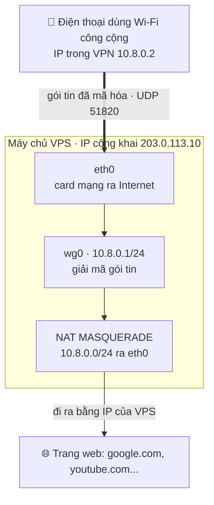
```mermaid
flowchart TB
    phone["📱 Điện thoại dùng Wi-Fi công cộng<br/>IP trong VPN 10.8.0.2"]
    subgraph vps["Máy chủ VPS · IP công khai 203.0.113.10"]
        direction LR
        eth0["eth0<br/>card mạng ra Internet"] --> wg0["wg0 · 10.8.0.1/24<br/>giải mã gói tin"] --> nat["NAT MASQUERADE<br/>10.8.0.0/24 ra eth0"]
    end
    web["🌐 Trang web: google.com, youtube.com..."]
    phone == "gói tin đã mã hóa · UDP 51820" ==> eth0
    nat -- "đi ra bằng IP của VPS" --> web
```

Trên đường truyền (Wi-Fi quán cà phê, nhà mạng...) chỉ thấy các gói UDP đã mã hóa gửi tới máy chủ của bạn.
Máy chủ giải mã rồi chuyển tiếp ra Internet bằng IP của VPS (NAT), nên trang web chỉ thấy IP của VPS.

### Thuật ngữ

| Thuật ngữ | Ý nghĩa |
|---|---|
| **Người dùng** (peer, client) | Một thiết bị kết nối VPN. Mỗi thiết bị nên có một người dùng riêng |
| **Endpoint** | Tên miền hoặc IP công khai của máy chủ, ghi trong file cấu hình để thiết bị biết kết nối tới đâu |
| **Dải mạng VPN** | Dải IP nội bộ trong đường hầm, mặc định `10.8.0.0/24` (máy chủ là `10.8.0.1`) |
| **AllowedIPs** | Phía thiết bị: những địa chỉ nào đi qua VPN. `0.0.0.0/0, ::/0` = toàn bộ lưu lượng |
| **PresharedKey** | Khóa đối xứng bổ sung cho từng người dùng, tăng thêm một lớp bảo mật |
| **Handshake** | Lần "bắt tay" gần nhất giữa thiết bị và máy chủ; có handshake trong 3 phút = đang **online** |
| **Keepalive** | Gói tin giữ kết nối (mặc định 25 giây) để đường hầm không bị NAT của nhà mạng cắt |

---

## 2. Yêu cầu hệ thống

| Thành phần | Yêu cầu |
|---|---|
| Máy chủ | VPS / máy chủ Linux **amd64** (x86_64), tối thiểu 1 vCPU, 512 MB RAM là đủ cho hàng trăm người dùng |
| Hệ điều hành | **Debian 11 / 12 / 13**, **Ubuntu 20.04 / 22.04 / 24.04** (đã kiểm thử); các bản Linux khác chạy được bằng gói `.tar.gz` |
| Kernel | Linux 5.6+ có sẵn WireGuard. Kernel cũ hoặc container không có module → tự dùng `wireguard-go` |
| Quyền | `root` (hoặc `sudo`) |
| Khởi động | `systemd` để tự chạy khi khởi động máy (không có systemd vẫn chạy được thủ công) |
| Mạng | IP công khai (hoặc mở cổng từ router), cổng **51820/udp** cho WireGuard và **51821/tcp** cho giao diện web |

> [!IMPORTANT]
> Nhiều nhà cung cấp VPS có **tường lửa riêng bên ngoài máy chủ** (AWS *Security Group*, Google Cloud *VPC firewall*,
> Oracle Cloud *Security List*, Azure *NSG*, tường lửa của Vultr / DigitalOcean / Vietnix...). Hãy mở
> **UDP 51820** và **TCP 51821** ở đó — trình cài đặt chỉ mở được tường lửa *bên trong* máy chủ (ufw / firewalld / iptables).

---

## 3. Cài đặt

### 3.1. Chọn cách cài

| Cách | Khi nào dùng |
|---|---|
| [Một lệnh](#32-cài-bằng-một-lệnh) | Nhanh nhất, tự chọn gói phù hợp (`.deb` nếu có `apt`, ngược lại dùng `.tar.gz`) |
| [Gói `.deb`](#33-cài-bằng-gói-deb) | Debian / Ubuntu, muốn quản lý bằng `apt` (cập nhật, gỡ bỏ gọn gàng) |
| [Bản `.tar.gz`](#34-cài-bằng-bản-targz) | Mọi bản Linux amd64, hoặc máy không có Internet (chép file lên rồi cài) |
| [Build từ mã nguồn](#35-build-từ-mã-nguồn) | Muốn tự sửa mã nguồn hoặc build cho kiến trúc khác |

### 3.2. Cài bằng một lệnh

```bash
curl -fsSL https://raw.githubusercontent.com/tlearnvn/tuan-wg/HEAD/scripts/install.sh | sudo bash
```

Script tải gói mới nhất từ [GitHub Releases](https://github.com/tlearnvn/tuan-wg/releases), cài đặt rồi chạy trình
cài đặt ở chế độ tự động. **Chưa có bản phát hành** thì script tự cài công cụ build (`build-essential`, `git`, `musl-tools`),
tải mã nguồn và build ngay trên máy chủ (khoảng 1 phút). Có thể tùy chỉnh bằng biến môi trường (đặt **sau** `sudo`):

```bash
# Đặt sẵn tên miền cho máy chủ
curl -fsSL https://raw.githubusercontent.com/tlearnvn/tuan-wg/HEAD/scripts/install.sh \
  | sudo TUAN_WG_ARGS="-y --endpoint vpn.tenmien.vn" bash

# Cài đúng một phiên bản
curl -fsSL https://raw.githubusercontent.com/tlearnvn/tuan-wg/HEAD/scripts/install.sh \
  | sudo TUAN_WG_VERSION=1.0.2 bash
```

| Biến | Ý nghĩa |
|---|---|
| `TUAN_WG_VERSION` | Cài một phiên bản cụ thể, ví dụ `1.0.2` (mặc định: bản mới nhất) |
| `TUAN_WG_ARGS` | Tham số truyền cho `tuan-wg install`, xem [tùy chọn](#37-các-tùy-chọn-của-tuan-wg-install) |
| `TUAN_WG_SOURCE=1` | Luôn build từ mã nguồn thay vì tải gói dựng sẵn |
| `TUAN_WG_GIT` | Kho mã nguồn dùng khi build (bản fork / mirror), mặc định `https://github.com/tlearnvn/tuan-wg.git` |

> [!NOTE]
> Dùng đúng link **raw.githubusercontent.com** như trên. Link trang web dạng `github.com/.../blob/...` trả về trang HTML
> nên `bash` báo lỗi `syntax error near unexpected token 'newline'`. Chữ `HEAD` trong link luôn trỏ tới nhánh mặc định của kho mã.
> Bản phát hành trên GitHub Releases được tạo tự động khi mã nguồn được đưa lên nhánh `main` ([mục 19](#19-dành-cho-nhà-phát-triển)).

### 3.3. Cài bằng gói .deb

```bash
wget https://github.com/tlearnvn/tuan-wg/releases/latest/download/tuan-wg_amd64.deb
sudo apt install ./tuan-wg_amd64.deb
```

- `apt` tự cài các gói cần thiết: `wireguard-tools`, `iptables`, `iproute2`.
- Ngay sau khi cài, gói tự chạy trình cài đặt (không hỏi) và in ra **địa chỉ web + mật khẩu quản trị**.
- Muốn tự chọn thông số: cài với `sudo TUAN_WG_SKIP_SETUP=1 apt install ./tuan-wg_amd64.deb` rồi chạy `sudo tuan-wg install`.
- Đã có file trên máy (ví dụ `tuan-wg_1.0.2_amd64.deb`): `sudo apt install ./tuan-wg_1.0.2_amd64.deb`.

### 3.4. Cài bằng bản .tar.gz

```bash
wget https://github.com/tlearnvn/tuan-wg/releases/latest/download/tuan-wg-linux-amd64.tar.gz
tar xzf tuan-wg-linux-amd64.tar.gz
cd tuan-wg-*-linux-amd64
sudo ./install.sh                 # hoặc: sudo ./install.sh -y --endpoint vpn.tenmien.vn
```

Gói gồm: `tuan-wg` (binary tĩnh, chạy trên mọi bản Linux amd64), `install.sh`, `tuan-wg.service`, trang man
`tuan-wg.1`, `README.md`, `CHANGELOG.md`, `LICENSE`. Trình cài đặt chép binary vào `/usr/local/bin/tuan-wg`.

### 3.5. Build từ mã nguồn

```bash
sudo apt install build-essential musl-tools git
git clone https://github.com/tlearnvn/tuan-wg.git
cd tuan-wg
make static                               # binary tĩnh: build/static/tuan-wg
sudo ./build/static/tuan-wg install
```

Không có `musl-tools` thì dùng `make` (binary liên kết động `build/tuan-wg`). Đóng gói: `make deb dist` → thư mục `dist/`.

### 3.6. Trình cài đặt làm những gì?

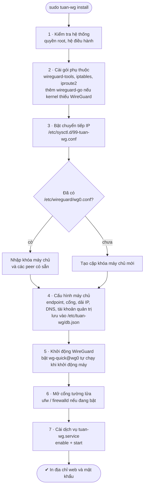
```mermaid
flowchart TD
    start(["sudo tuan-wg install"]) --> s1["1 · Kiểm tra hệ thống<br/>quyền root, hệ điều hành"]
    s1 --> s2["2 · Cài gói phụ thuộc<br/>wireguard-tools, iptables, iproute2<br/>thêm wireguard-go nếu kernel thiếu WireGuard"]
    s2 --> s3["3 · Bật chuyển tiếp IP<br/>/etc/sysctl.d/99-tuan-wg.conf"]
    s3 --> q{"Đã có<br/>/etc/wireguard/wg0.conf?"}
    q -- "có" --> imp["Nhập khóa máy chủ<br/>và các peer có sẵn"]
    q -- "chưa" --> gen["Tạo cặp khóa máy chủ mới"]
    imp --> s4["4 · Cấu hình máy chủ<br/>endpoint, cổng, dải IP, DNS, tài khoản quản trị<br/>lưu vào /etc/tuan-wg/db.json"]
    gen --> s4
    s4 --> s5["5 · Khởi động WireGuard<br/>bật wg-quick@wg0 tự chạy khi khởi động máy"]
    s5 --> s6["6 · Mở cổng tường lửa<br/>ufw / firewalld nếu đang bật"]
    s6 --> s7["7 · Cài dịch vụ tuan-wg.service<br/>enable + start"]
    s7 --> done(["✔ In địa chỉ web và mật khẩu"])
```

<p align="center">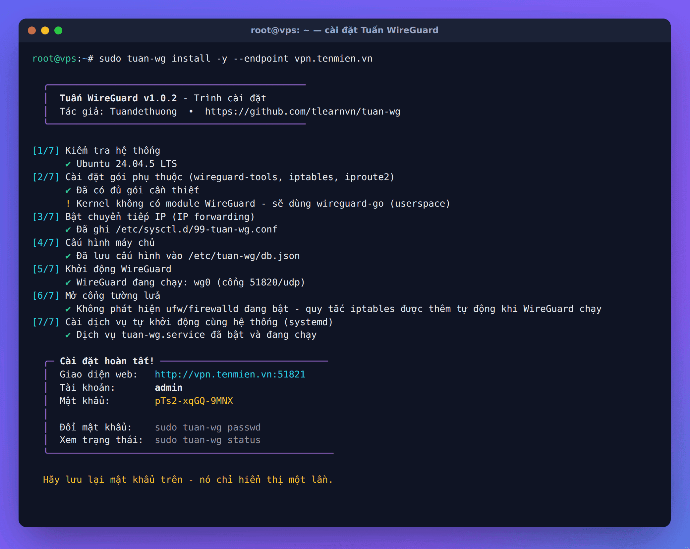</p>

> [!TIP]
> Dòng `! Kernel không có module WireGuard - sẽ dùng wireguard-go` chỉ xuất hiện trên kernel/container không có
> WireGuard (ảnh trên chụp trong container). Trên VPS Debian/Ubuntu thông thường bạn sẽ thấy `✔ Kernel hỗ trợ WireGuard`.

Mật khẩu quản trị **chỉ hiển thị một lần** — hãy lưu lại. Quên thì đặt lại bằng `sudo tuan-wg passwd`.

### 3.7. Các tùy chọn của tuan-wg install

| Tùy chọn | Mặc định | Ý nghĩa |
|---|---|---|
| `-y`, `--yes` | | Không hỏi, dùng giá trị mặc định / tự phát hiện |
| `--endpoint HOST` | IP công khai tự phát hiện | Tên miền hoặc IP công khai của máy chủ |
| `--port N` | `51820` | Cổng WireGuard (UDP) |
| `--web-port N` | `51821` | Cổng giao diện web (TCP) |
| `--web-listen IP` | `0.0.0.0` | Địa chỉ lắng nghe của web (`127.0.0.1` nếu dùng reverse proxy) |
| `--subnet CIDR` | `10.8.0.1/24` | Dải IP mạng VPN (IP máy chủ / prefix) |
| `--dns LIST` | `1.1.1.1, 8.8.8.8` | DNS cho người dùng |
| `--user NAME` | `admin` | Tên đăng nhập quản trị |
| `--password PASS` | tạo ngẫu nhiên | Mật khẩu quản trị (tối thiểu 8 ký tự) |
| `--no-deps` | | Không tự cài gói bằng `apt` |
| `--no-service` | | Không tạo dịch vụ systemd |
| `--no-import` | | Không nhập cấu hình WireGuard có sẵn |

Ví dụ:

```bash
sudo tuan-wg install                                   # hỏi từng bước (Enter = giữ giá trị gợi ý)
sudo tuan-wg install -y --endpoint vpn.tenmien.vn      # tự động hoàn toàn
sudo tuan-wg install -y --port 443 --web-port 8443     # đổi cổng (UDP 443 dễ đi qua mạng bị chặn)
sudo tuan-wg install -y --subnet 10.66.0.1/22          # dải lớn hơn: tối đa 1.021 người dùng
```

Chạy lại `tuan-wg install` trên máy đã cài **không làm mất dữ liệu**: người dùng, khóa, thống kê được giữ nguyên,
chỉ các thông số bạn truyền vào (hoặc nhập lại) được cập nhật.

### 3.8. Kiểm tra sau khi cài

```bash
sudo tuan-wg status                               # tổng hợp trạng thái
systemctl status tuan-wg wg-quick@wg0 --no-pager  # hai dịch vụ systemd
sudo wg show                                      # trạng thái WireGuard gốc
```

<p align="center">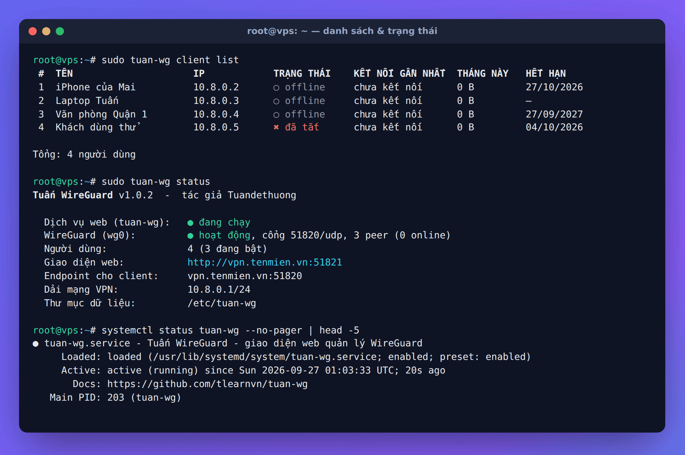</p>

---

## 4. Đăng nhập lần đầu

Mở trình duyệt tới `http://IP-máy-chủ:51821` (hoặc địa chỉ được in ra khi cài đặt), nhập tài khoản `admin` và mật khẩu.

<p align="center">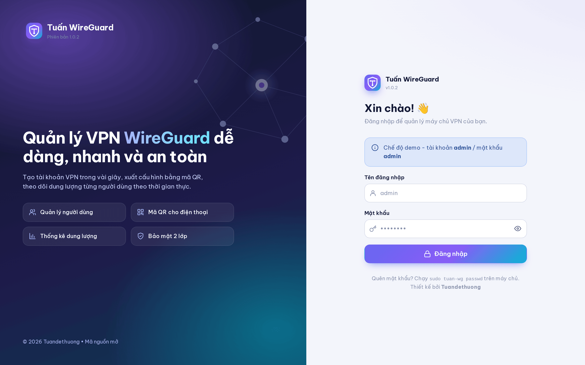</p>

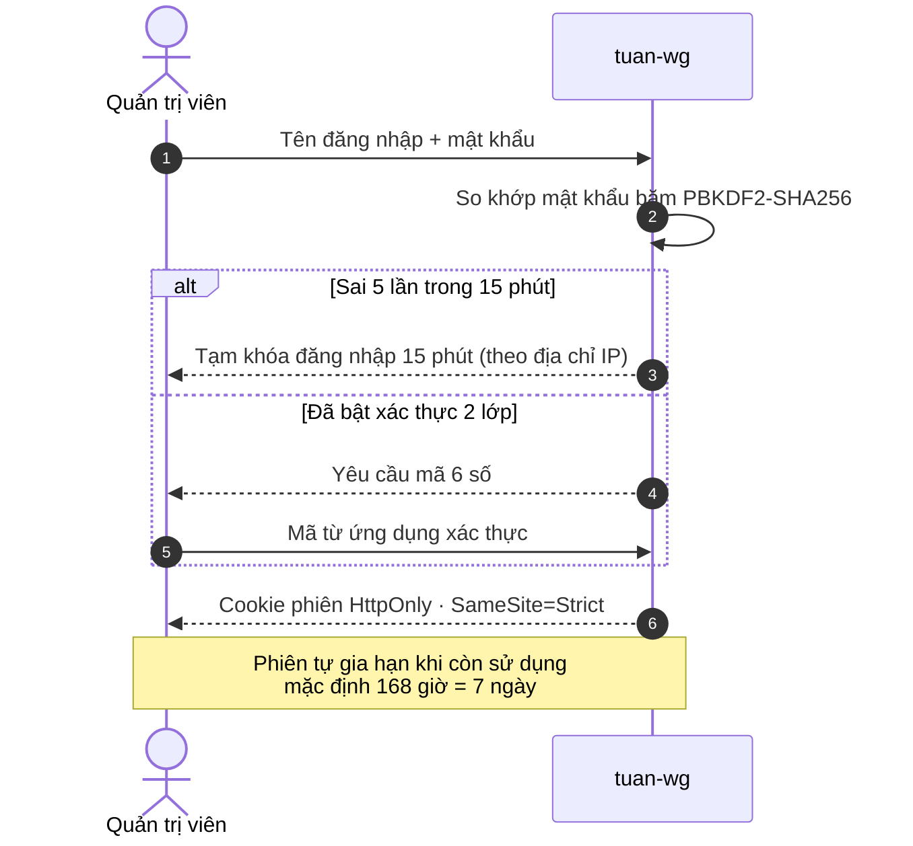
```mermaid
sequenceDiagram
    autonumber
    actor A as Quản trị viên
    participant S as tuan-wg
    A->>S: Tên đăng nhập + mật khẩu
    S->>S: So khớp mật khẩu băm PBKDF2-SHA256
    alt Sai 5 lần trong 15 phút
        S-->>A: Tạm khóa đăng nhập 15 phút (theo địa chỉ IP)
    else Đã bật xác thực 2 lớp
        S-->>A: Yêu cầu mã 6 số
        A->>S: Mã từ ứng dụng xác thực
    end
    S-->>A: Cookie phiên HttpOnly · SameSite=Strict
    Note over A,S: Phiên tự gia hạn khi còn sử dụng<br/>mặc định 168 giờ = 7 ngày
```

Việc nên làm ngay sau khi đăng nhập:

1. **Đổi mật khẩu** và **bật xác thực 2 lớp** — [mục 9.3](#93-tài-khoản-và-bảo-mật).
2. **Kiểm tra Endpoint** (tên miền / IP công khai) — [mục 9.1](#91-wireguard).
3. Cân nhắc **HTTPS** hoặc chỉ cho truy cập qua VPN — [mục 13](#13-bảo-mật-nâng-cao).

Nút **Tối / Sáng** ở góc dưới thanh bên đổi giao diện; **Thoát** để đăng xuất.

---

## 5. Trang Tổng quan

<p align="center">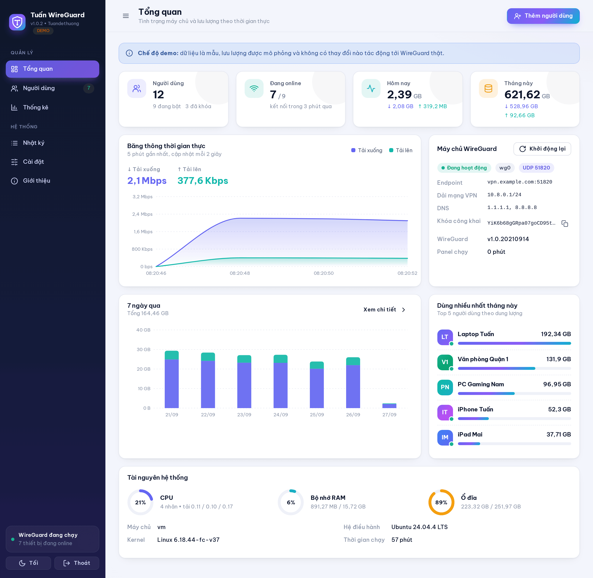</p>

| Khu vực | Nội dung |
|---|---|
| **Người dùng** | Tổng số người dùng, bao nhiêu đang bật / đã khóa |
| **Đang online** | Số thiết bị có handshake trong 3 phút qua trên tổng số đang bật |
| **Hôm nay / Tháng này** | Tổng dung lượng, tách ↓ tải xuống và ↑ tải lên (theo múi giờ thống kê) |
| **Băng thông thời gian thực** | Tốc độ toàn máy chủ trong 5 phút gần nhất, cập nhật mỗi 2 giây |
| **Máy chủ WireGuard** | Trạng thái, interface, cổng, endpoint, dải mạng, DNS, khóa công khai (bấm để sao chép), phiên bản WireGuard, nút **Khởi động lại** |
| **7 ngày qua** | Biểu đồ dung lượng theo ngày; **Xem chi tiết** mở trang Thống kê |
| **Dùng nhiều nhất tháng này** | 5 người dùng tốn dung lượng nhất |
| **Tài nguyên hệ thống** | CPU (tải 1/5/15 phút), RAM, ổ đĩa, tên máy, hệ điều hành, kernel, thời gian chạy |

Góc dưới thanh bên luôn hiển thị trạng thái WireGuard và số thiết bị đang online.

---

## 6. Quản lý người dùng

### 6.1. Danh sách người dùng

<p align="center">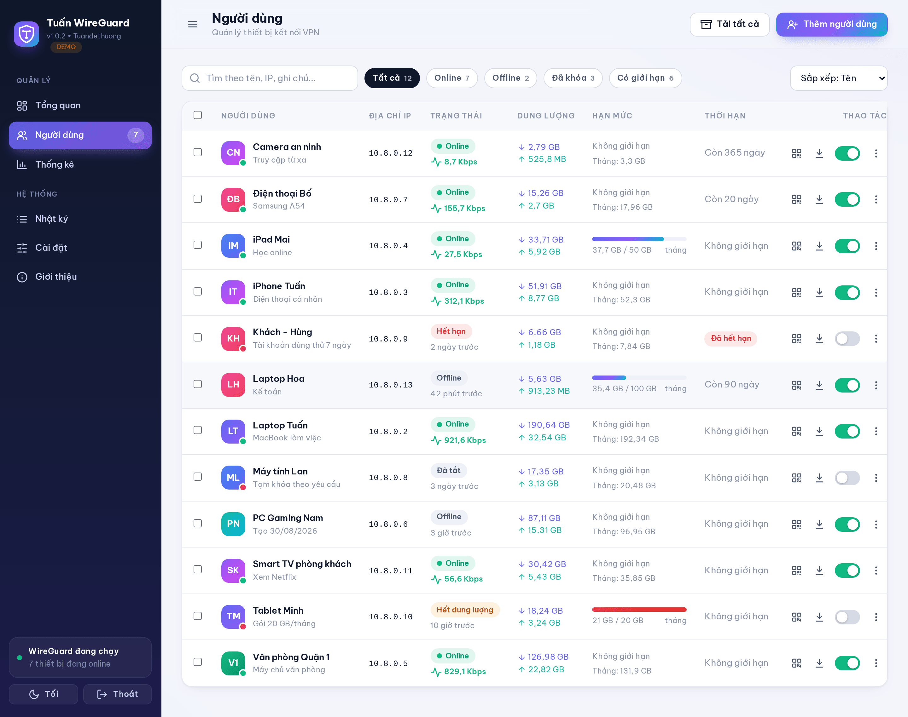</p>

- **Tìm kiếm** theo tên, IP, ghi chú. **Lọc**: *Tất cả, Online, Offline, Đã khóa, Có giới hạn* (kèm số lượng).
- **Sắp xếp**: tên, mới tạo, dùng nhiều nhất, online gần đây, địa chỉ IP.
- Cột **Dung lượng**: tổng ↓ tải xuống / ↑ tải lên. Cột **Hạn mức**: thanh tiến độ khi có hạn mức, "Tháng: …" là dung lượng tháng này.
- Nút ở cột **Thao tác**: mã QR, tải `.conf`, công tắc bật/tắt, menu `⋮` ([mục 6.6](#66-sửa-tắt-xóa-và-các-thao-tác-khác)).
- **Tải tất cả** (góc trên) tải file `.zip` chứa cấu hình của mọi người dùng.

| Trạng thái | Ý nghĩa |
|---|---|
| 🟢 **Online** + tốc độ | Có handshake trong 3 phút qua, đang truyền dữ liệu |
| ⚪ **Offline** + "x phút trước" | Đang bật nhưng thiết bị không kết nối (tắt VPN, mất mạng...) |
| **Đã tắt** | Quản trị viên tắt thủ công |
| 🔴 **Hết hạn** | Đã qua ngày hết hạn — tự khóa |
| 🟠 **Hết dung lượng** | Dùng vượt hạn mức — tự khóa |

### 6.2. Thêm người dùng

Bấm **Thêm người dùng** ở góc trên bên phải.

<table>
<tr>
<td width="50%" valign="top">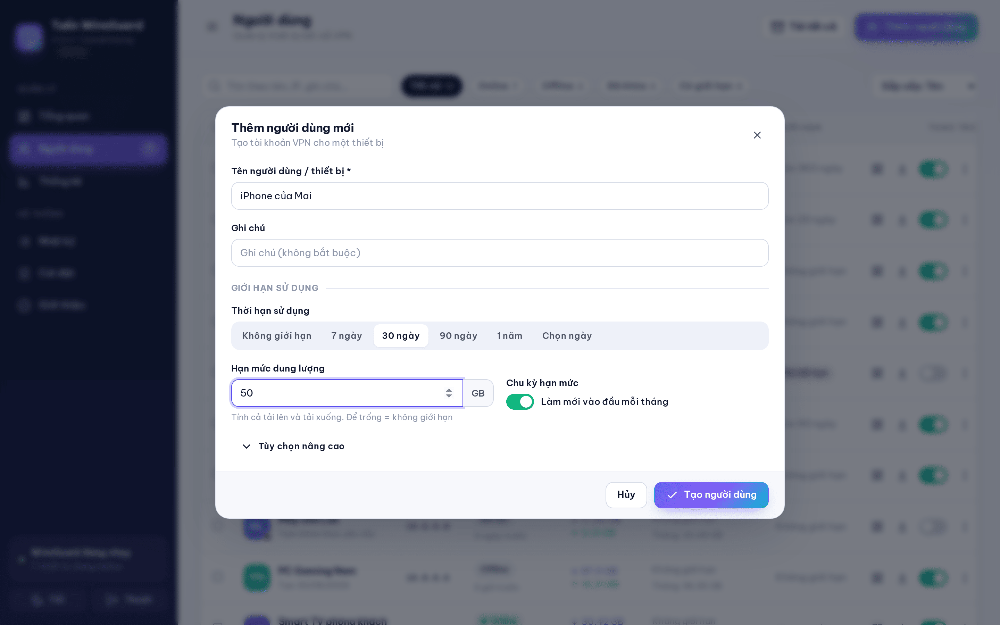</td>
<td width="50%" valign="top">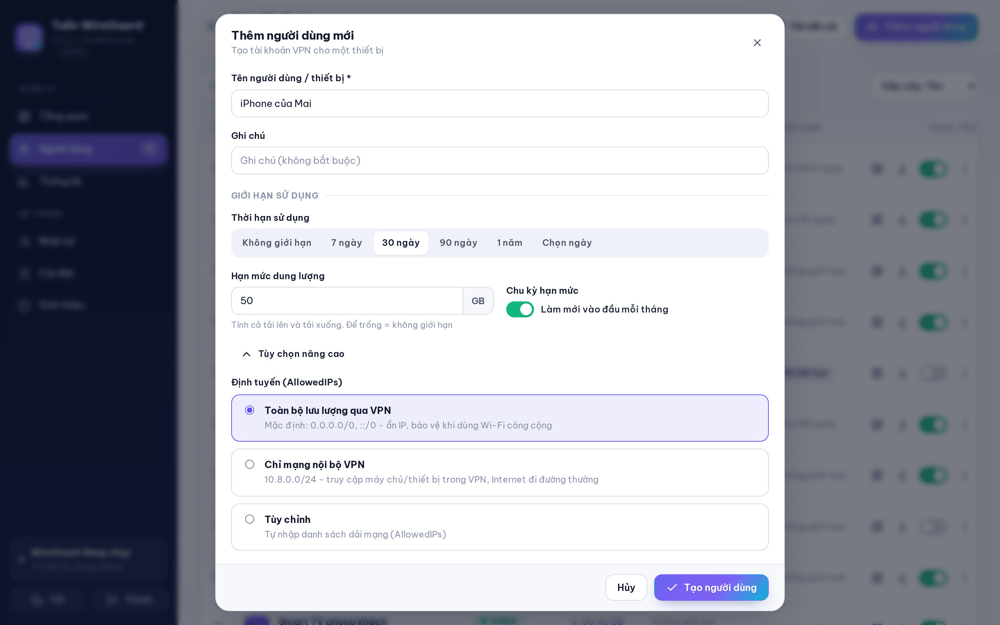</td>
</tr>
</table>

| Trường | Ý nghĩa |
|---|---|
| **Tên người dùng / thiết bị** \* | Tên dễ nhận biết, không trùng, ví dụ "iPhone của Mai", "Laptop kế toán" |
| **Ghi chú** | Thông tin thêm (số điện thoại, phòng ban...) — tìm kiếm được |
| **Thời hạn sử dụng** | Không giới hạn, 7 ngày, 30 ngày, 90 ngày, 1 năm hoặc **Chọn ngày** cụ thể |
| **Hạn mức dung lượng** (GB) | Tính cả tải lên và tải xuống. Để trống = không giới hạn |
| **Chu kỳ hạn mức** | Bật **Làm mới vào đầu mỗi tháng** để hạn mức tính theo tháng; tắt = hạn mức tổng |
| **Định tuyến (AllowedIPs)** | *Toàn bộ lưu lượng qua VPN* (ẩn IP, an toàn khi dùng Wi-Fi công cộng) · *Chỉ mạng nội bộ VPN* (chỉ truy cập máy trong VPN, Internet đi đường thường) · *Tùy chỉnh* |
| **Địa chỉ IP trong VPN** | Để trống để tự cấp IP còn trống; nhập nếu muốn IP cố định |
| **DNS**, **Persistent Keepalive**, **MTU** | Ghi đè giá trị mặc định của máy chủ cho riêng người dùng này |

Khi bấm **Tạo người dùng**, ứng dụng tạo khóa, cấp IP và áp dụng ngay vào WireGuard:

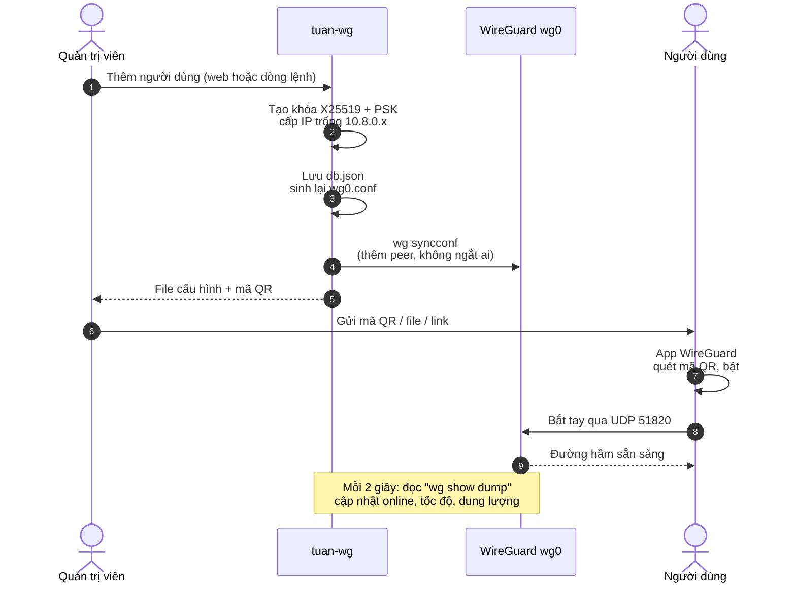
```mermaid
sequenceDiagram
    autonumber
    actor A as Quản trị viên
    participant S as tuan-wg
    participant K as WireGuard wg0
    actor U as Người dùng
    A->>S: Thêm người dùng (web hoặc dòng lệnh)
    S->>S: Tạo khóa X25519 + PSK<br/>cấp IP trống 10.8.0.x
    S->>S: Lưu db.json<br/>sinh lại wg0.conf
    S->>K: wg syncconf<br/>(thêm peer, không ngắt ai)
    S-->>A: File cấu hình + mã QR
    A->>U: Gửi mã QR / file / link
    U->>U: App WireGuard<br/>quét mã QR, bật
    U->>K: Bắt tay qua UDP 51820
    K-->>U: Đường hầm sẵn sàng
    Note over S,K: Mỗi 2 giây: đọc "wg show dump"<br/>cập nhật online, tốc độ, dung lượng
```

> [!TIP]
> Mỗi thiết bị nên là **một người dùng riêng**. Dùng chung một cấu hình cho nhiều thiết bị cùng lúc sẽ khiến
> chúng tranh nhau kết nối (WireGuard chỉ giữ một endpoint cho mỗi khóa) và thống kê không chính xác.

### 6.3. Kết nối thiết bị

Bấm vào tên người dùng (hoặc biểu tượng mã QR) để mở hộp thoại chi tiết. Tab **Kết nối**:

<p align="center">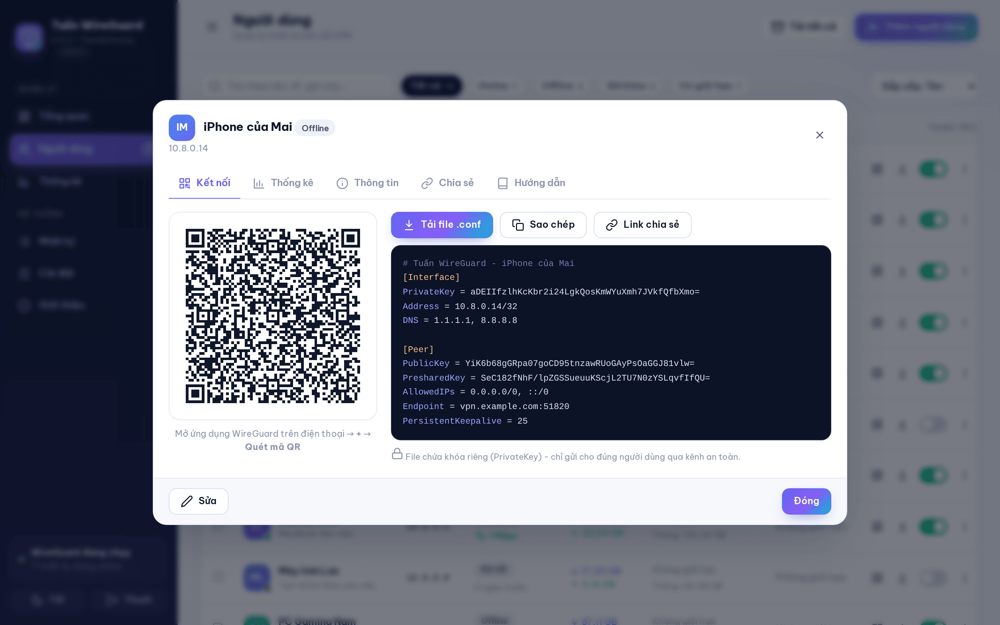</p>

- **Mã QR**: mở ứng dụng WireGuard trên điện thoại → **+** → **Quét mã QR**.
- **Tải file .conf**: dùng cho máy tính (Windows, macOS, Linux) hoặc gửi cho người dùng.
- **Sao chép**: chép nội dung cấu hình vào bộ nhớ tạm. **Link chia sẻ**: chuyển sang tab Chia sẻ.
- Bên dưới là nội dung file cấu hình (tô màu cú pháp).

> [!WARNING]
> File cấu hình chứa **khóa riêng (PrivateKey)** của người dùng. Ai có file này đều kết nối được VPN dưới danh nghĩa
> người đó — chỉ gửi cho đúng người, qua kênh an toàn. Lỡ lộ thì dùng **Tạo lại khóa** ([mục 6.6](#66-sửa-tắt-xóa-và-các-thao-tác-khác)).

Tab **Hướng dẫn** có sẵn các bước cho từng hệ điều hành kèm liên kết tải ứng dụng WireGuard chính thức (miễn phí):

<p align="center">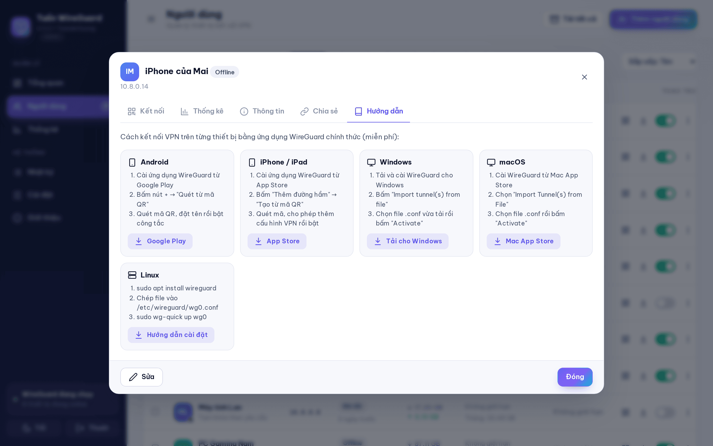</p>

| Thiết bị | Cách thêm cấu hình |
|---|---|
| **Android** | Cài *WireGuard* từ Google Play → **+** → **Quét từ mã QR** → đặt tên → bật công tắc |
| **iPhone / iPad** | Cài *WireGuard* từ App Store → **Thêm đường hầm** → **Tạo từ mã QR** → cho phép thêm cấu hình VPN → bật |
| **Windows** | Tải WireGuard tại wireguard.com → **Import tunnel(s) from file** → chọn file `.conf` → **Activate** |
| **macOS** | Cài *WireGuard* từ Mac App Store → **Import Tunnel(s) from File** → chọn file `.conf` → **Activate** |
| **Linux** | `sudo apt install wireguard` → chép file vào `/etc/wireguard/wg0.conf` → `sudo wg-quick up wg0` |

Có thể tạo cấu hình ngay trên máy chủ bằng dòng lệnh và quét mã QR hiện trong terminal ([mục 11](#11-dòng-lệnh)).

### 6.4. Link chia sẻ

Thay vì gửi file, bạn gửi một **đường link có thời hạn**. Người nhận mở link là thấy mã QR và nút tải cấu hình,
**không cần tài khoản**.

<table>
<tr>
<td width="50%" valign="top">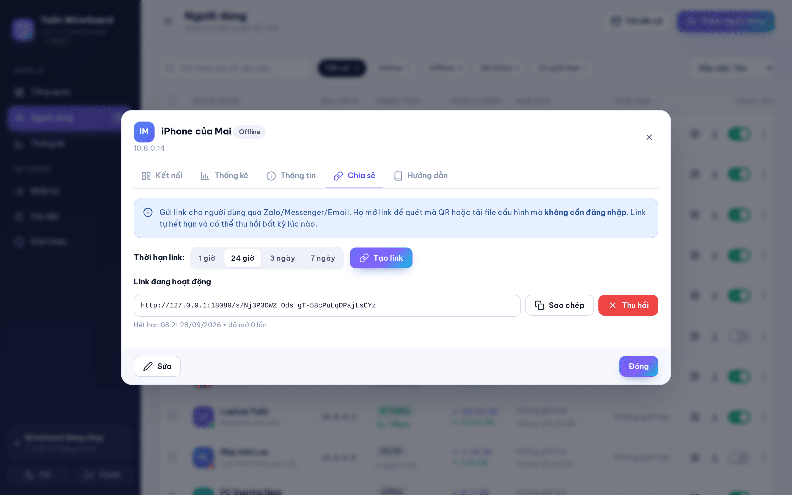<br><sub>Quản trị viên: chọn thời hạn → <b>Tạo link</b> → <b>Sao chép</b> hoặc <b>Thu hồi</b></sub></td>
<td width="50%" valign="top">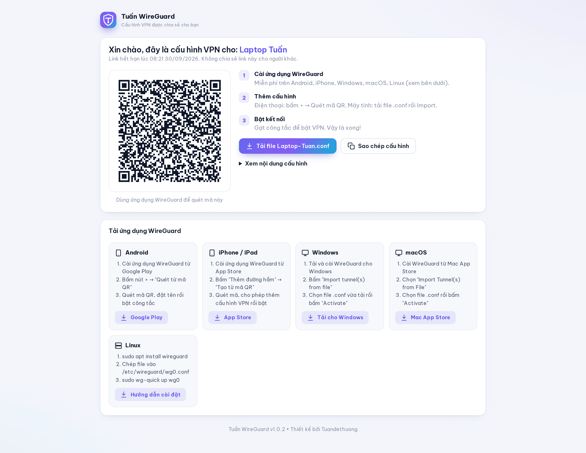<br><sub>Người dùng: trang có mã QR, nút tải file <code>.conf</code> và hướng dẫn cài</sub></td>
</tr>
</table>

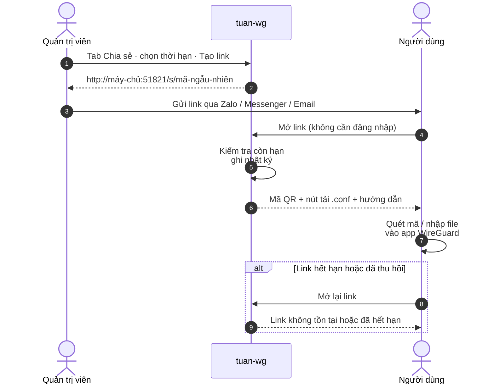
```mermaid
sequenceDiagram
    autonumber
    actor A as Quản trị viên
    participant S as tuan-wg
    actor U as Người dùng
    A->>S: Tab Chia sẻ · chọn thời hạn · Tạo link
    S-->>A: http://máy-chủ:51821/s/mã-ngẫu-nhiên
    A->>U: Gửi link qua Zalo / Messenger / Email
    U->>S: Mở link (không cần đăng nhập)
    S->>S: Kiểm tra còn hạn<br/>ghi nhật ký
    S-->>U: Mã QR + nút tải .conf + hướng dẫn
    U->>U: Quét mã / nhập file<br/>vào app WireGuard
    alt Link hết hạn hoặc đã thu hồi
        U->>S: Mở lại link
        S-->>U: Link không tồn tại hoặc đã hết hạn
    end
```

- Thời hạn: **1 giờ, 24 giờ, 3 ngày, 7 ngày**. Link hiển thị giờ hết hạn và **số lần đã mở**.
- **Thu hồi** để vô hiệu hóa link ngay lập tức. **Tạo lại khóa** cũng hủy mọi link cũ của người dùng đó.
- Link dùng địa chỉ bạn đang truy cập trang quản trị — nếu đang mở bằng `127.0.0.1` hay IP nội bộ, hãy truy cập
  bằng tên miền / IP công khai trước khi tạo link để người nhận mở được.

> [!CAUTION]
> Ai có link đều lấy được cấu hình trong thời gian link còn hạn. Chọn thời hạn ngắn và thu hồi sau khi người dùng đã cài xong.

### 6.5. Thống kê và thông tin từng người

<table>
<tr>
<td width="50%" valign="top">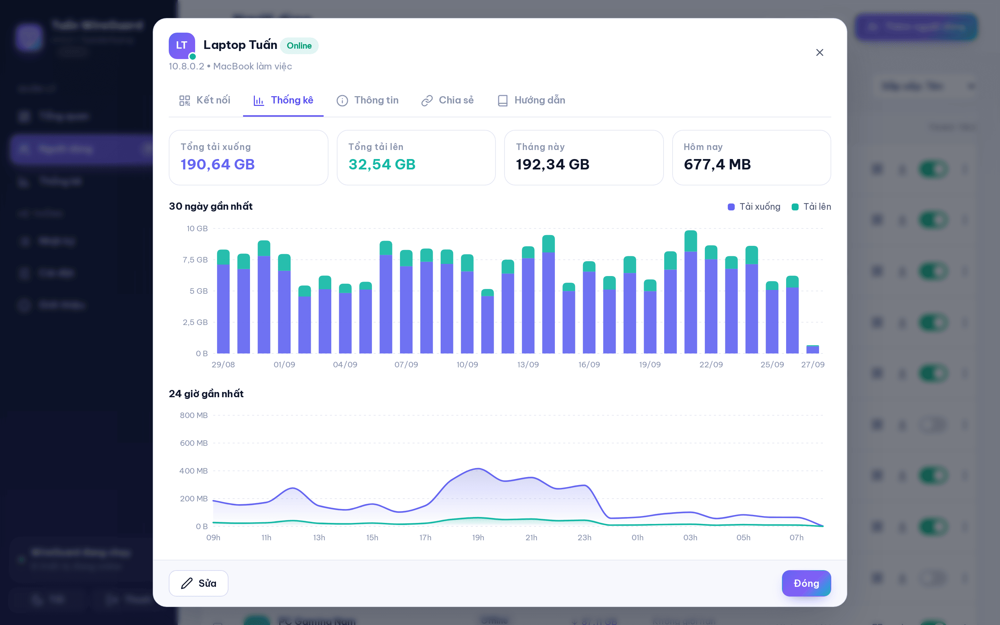<br><sub>Tab <b>Thống kê</b>: tổng tải xuống / tải lên, tháng này, hôm nay; biểu đồ 30 ngày và 24 giờ gần nhất</sub></td>
<td width="50%" valign="top">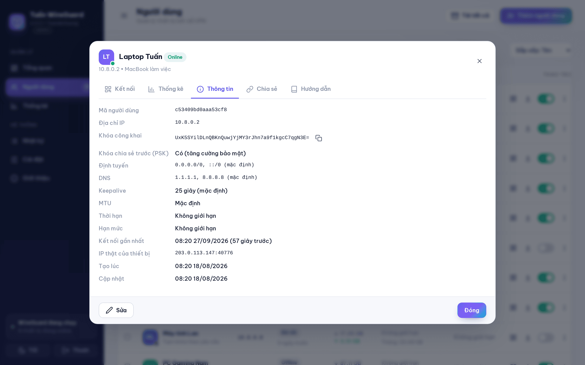<br><sub>Tab <b>Thông tin</b>: IP, khóa công khai, PSK, định tuyến, DNS, thời hạn, hạn mức, lần kết nối gần nhất, IP thật của thiết bị</sub></td>
</tr>
</table>

### 6.6. Sửa, tắt, xóa và các thao tác khác

<p align="center">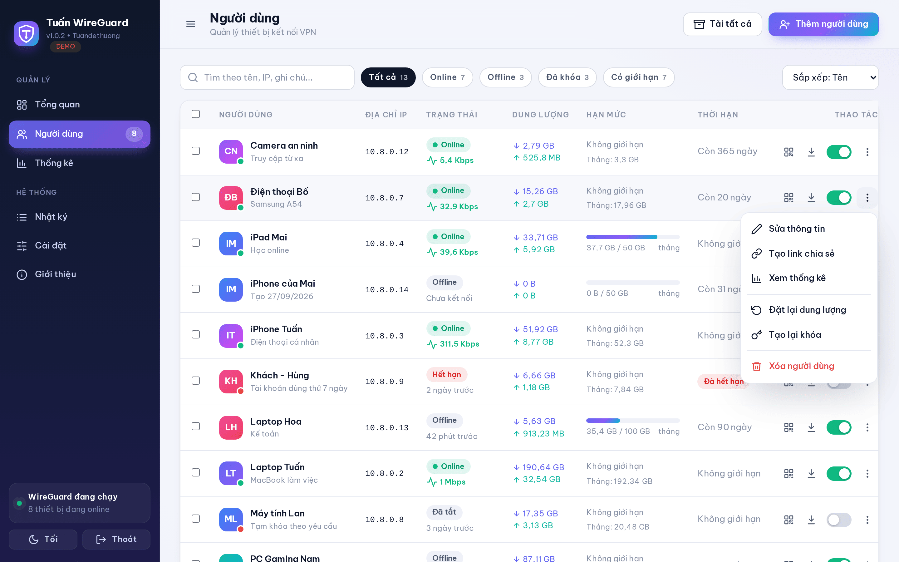</p>

| Thao tác | Tác dụng |
|---|---|
| **Công tắc bật/tắt** | Tắt: gỡ peer khỏi WireGuard ngay lập tức (thiết bị mất kết nối), cấu hình vẫn giữ. Bật: kết nối lại được |
| **Sửa thông tin** | Đổi tên, ghi chú, thời hạn, hạn mức, tùy chọn nâng cao. Gia hạn người dùng đã hết hạn cũng ở đây |
| **Tạo link chia sẻ** / **Xem thống kê** | Mở nhanh tab tương ứng |
| **Đặt lại dung lượng** | Đưa bộ đếm dung lượng về 0 (lịch sử theo ngày vẫn giữ). Người dùng đang bị khóa vì hết dung lượng được mở lại |
| **Tạo lại khóa** | Sinh khóa mới: cấu hình cũ **mất hiệu lực** (dùng khi lộ file cấu hình / mất thiết bị), link chia sẻ cũ bị hủy |
| **Xóa người dùng** | Xóa hẳn người dùng và gỡ khỏi WireGuard (có hỏi xác nhận) |

### 6.7. Thao tác hàng loạt

Tích chọn nhiều người dùng (hoặc ô "chọn tất cả" ở đầu bảng) để **Bật, Tắt, Đặt lại dung lượng** hoặc **Xóa** cùng lúc.

<p align="center">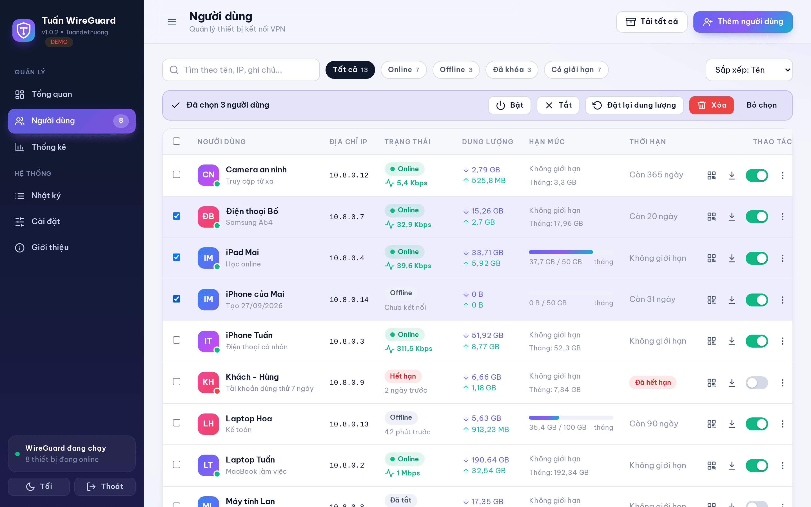</p>

### 6.8. Thời hạn và hạn mức dung lượng

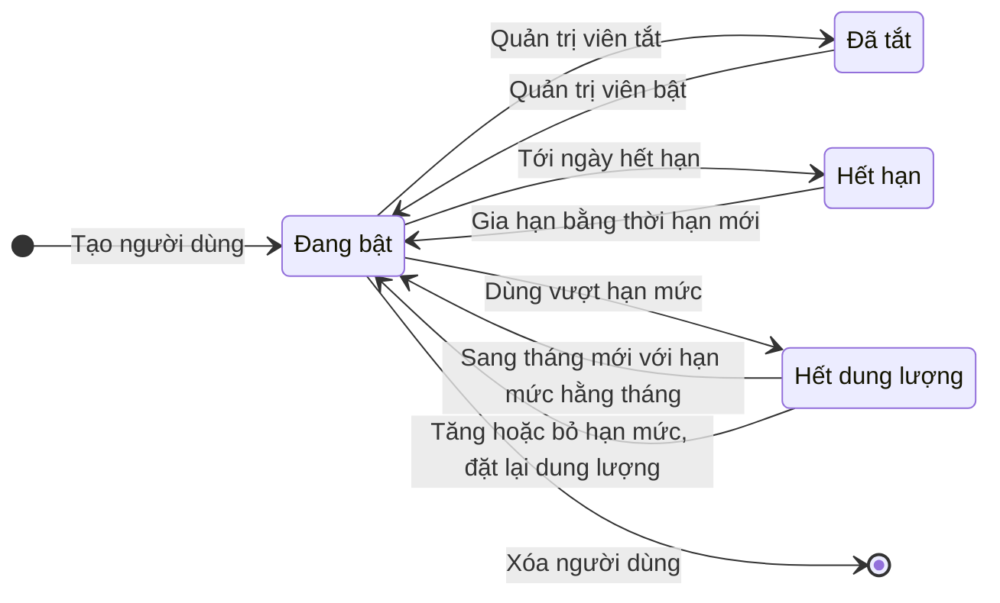
```mermaid
stateDiagram-v2
    direction LR
    DangBat: Đang bật
    DaTat: Đã tắt
    HetHan: Hết hạn
    HetDungLuong: Hết dung lượng
    [*] --> DangBat: Tạo người dùng
    DangBat --> DaTat: Quản trị viên tắt
    DaTat --> DangBat: Quản trị viên bật
    DangBat --> HetHan: Tới ngày hết hạn
    HetHan --> DangBat: Gia hạn bằng thời hạn mới
    DangBat --> HetDungLuong: Dùng vượt hạn mức
    HetDungLuong --> DangBat: Sang tháng mới với hạn mức hằng tháng
    HetDungLuong --> DangBat: Tăng hoặc bỏ hạn mức, đặt lại dung lượng
    DangBat --> [*]: Xóa người dùng
```

- **Thời hạn**: tới thời điểm hết hạn, người dùng bị **tự khóa** (gỡ khỏi WireGuard). Sửa thông tin → chọn thời hạn mới → **tự mở khóa**.
- **Hạn mức**: tính **cả tải lên và tải xuống**. Khi vượt → tự khóa.
  - *Hạn mức hằng tháng*: tự mở lại vào **đầu tháng mới** (theo [múi giờ thống kê](#91-wireguard)).
  - *Hạn mức tổng*: mở lại bằng cách tăng / bỏ hạn mức, hoặc **Đặt lại dung lượng**.
- Mọi lần tự khóa / tự mở khóa đều được ghi vào [nhật ký](#8-nhật-ký-hoạt-động). Việc kiểm tra diễn ra mỗi 2 giây.

---

## 7. Thống kê dung lượng

<p align="center">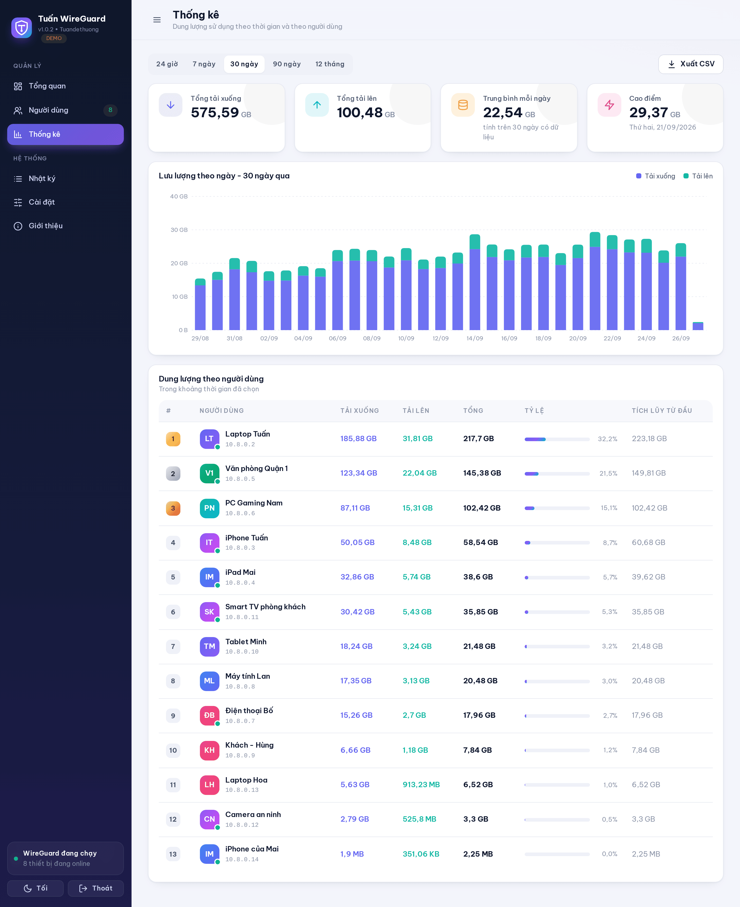</p>

- Chọn khoảng thời gian: **24 giờ, 7 ngày, 30 ngày, 90 ngày, 12 tháng**.
- Các thẻ: tổng tải xuống, tổng tải lên, trung bình mỗi ngày, ngày / giờ cao điểm.
- Biểu đồ cột theo giờ / ngày / tháng (rê chuột để xem số liệu chi tiết).
- Bảng **Dung lượng theo người dùng** trong khoảng đã chọn: xếp hạng, tỷ lệ, tổng tích lũy từ đầu.
- **Xuất CSV** để mở bằng Excel / Google Sheets (mã hóa UTF-8, hiển thị đúng tiếng Việt).

Cách số liệu được thu thập:

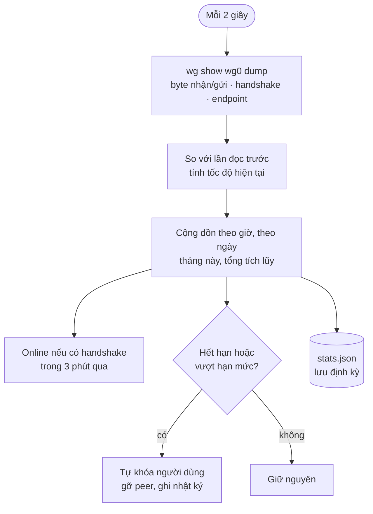
```mermaid
flowchart TD
    tick(["Mỗi 2 giây"]) --> dump["wg show wg0 dump<br/>byte nhận/gửi · handshake · endpoint"]
    dump --> delta["So với lần đọc trước<br/>tính tốc độ hiện tại"]
    delta --> buckets["Cộng dồn theo giờ, theo ngày<br/>tháng này, tổng tích lũy"]
    buckets --> online["Online nếu có handshake<br/>trong 3 phút qua"]
    buckets --> limit{"Hết hạn hoặc<br/>vượt hạn mức?"}
    buckets --> save[("stats.json<br/>lưu định kỳ")]
    limit -- "có" --> lock["Tự khóa người dùng<br/>gỡ peer, ghi nhật ký"]
    limit -- "không" --> keep["Giữ nguyên"]
```

| Dữ liệu | Thời gian lưu |
|---|---|
| Băng thông thời gian thực | 5 phút gần nhất (mẫu mỗi 2 giây) |
| Theo giờ | 7 ngày (toàn máy chủ), 48 giờ (từng người dùng) |
| Theo ngày | 400 ngày (toàn máy chủ), 120 ngày (từng người dùng) |
| Tổng tích lũy, tháng này | Suốt vòng đời người dùng |

> [!NOTE]
> Dung lượng được đếm tại máy chủ theo bộ đếm của WireGuard. Khởi động lại WireGuard hay máy chủ **không làm mất**
> thống kê. "Tải xuống" là dữ liệu máy chủ gửi tới thiết bị, "tải lên" là chiều ngược lại.

---

## 8. Nhật ký hoạt động

<p align="center">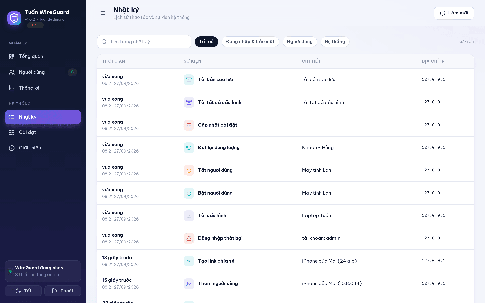</p>

Ghi lại mọi sự kiện quan trọng kèm thời gian và địa chỉ IP. Lọc theo nhóm **Đăng nhập & bảo mật / Người dùng / Hệ thống**
hoặc tìm kiếm theo nội dung. Nhật ký lưu tại `/etc/tuan-wg/audit.log`, giữ **5.000 sự kiện** gần nhất.

| Nhóm | Sự kiện |
|---|---|
| Đăng nhập & bảo mật | Đăng nhập, đăng nhập thất bại, đăng xuất, đổi mật khẩu, đổi tên đăng nhập, bật/tắt 2FA, đăng xuất phiên khác |
| Người dùng | Thêm, cập nhật, xóa, bật, tắt, đặt lại dung lượng, tạo lại khóa, tải cấu hình, thao tác hàng loạt, tạo / thu hồi / mở link chia sẻ, tải qua link, tải tất cả cấu hình |
| Hệ thống | Tự động khóa, tự động mở khóa, cập nhật cài đặt, khởi động lại WireGuard, tải bản sao lưu, khôi phục dữ liệu |

> [!TIP]
> Thấy nhiều dòng **Đăng nhập thất bại** từ IP lạ? Hãy bật 2FA và giới hạn truy cập trang quản trị ([mục 13](#13-bảo-mật-nâng-cao)).

---

## 9. Cài đặt

### 9.1. WireGuard

<p align="center">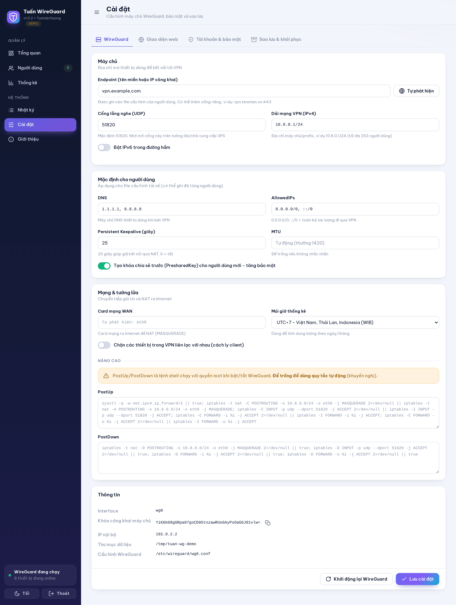</p>

| Nhóm | Trường | Ý nghĩa |
|---|---|---|
| Máy chủ | **Endpoint** | Tên miền hoặc IP công khai (có thể kèm cổng riêng, ví dụ `vpn.tenmien.vn:443`). Nút **Tự phát hiện** lấy IP công khai hiện tại |
| | **Cổng lắng nghe (UDP)** | Mặc định `51820`. Nhớ mở cổng này trên tường lửa nhà cung cấp VPS |
| | **Dải mạng VPN (IPv4)** | Ví dụ `10.8.0.1/24` (253 người dùng), `/22` → 1.021 người dùng. Prefix từ `/16` đến `/29`; ứng dụng quản lý tối đa 4.000 người dùng |
| | **Bật IPv6 trong đường hầm** | Cấp thêm địa chỉ IPv6 nội bộ (`fd42:42:42::/64`) cho người dùng |
| Mặc định cho người dùng | **DNS** | Máy chủ DNS thiết bị dùng khi bật VPN (ví dụ `1.1.1.1, 8.8.8.8`) |
| | **AllowedIPs** | `0.0.0.0/0, ::/0` = toàn bộ lưu lượng đi qua VPN |
| | **Persistent Keepalive** | 25 giây giúp giữ kết nối qua NAT; `0` = tắt |
| | **MTU** | Để trống = tự động. Đặt `1280`–`1380` nếu một số trang web tải không hết |
| | **PresharedKey** | Tạo khóa chia sẻ trước cho người dùng mới — tăng bảo mật |
| Mạng & tường lửa | **Card mạng WAN** | Card ra Internet để NAT (để trống = tự phát hiện, ví dụ `eth0`, `ens3`) |
| | **Múi giờ thống kê** | Dùng để chia dung lượng theo ngày / tháng (mặc định UTC+7) |
| | **Cách ly client** | Chặn các thiết bị trong VPN liên lạc với nhau |
| Nâng cao | **PostUp / PostDown** | Lệnh shell chạy với quyền root khi bật / tắt WireGuard. **Để trống để dùng quy tắc tự động** (khuyên dùng) |

Bấm **Lưu cài đặt** để áp dụng. Một số thay đổi cần **khởi động lại WireGuard** (tự thực hiện, các thiết bị mất kết nối
vài giây): cổng, dải mạng, IPv6, MTU, card mạng WAN, PostUp/PostDown, cách ly client. Các thay đổi còn lại áp dụng nóng.

> [!WARNING]
> Đổi **Endpoint**, **cổng** hoặc **dải mạng VPN** làm file cấu hình cũ của người dùng không còn đúng (đổi dải mạng sẽ
> đánh lại IP cho mọi người dùng). Sau khi đổi, hãy gửi lại mã QR / link chia sẻ cho mọi người. Dùng **tên miền** làm
> Endpoint giúp bạn đổi IP máy chủ sau này mà không phải cấp lại cấu hình.

### 9.2. Giao diện web

<p align="center">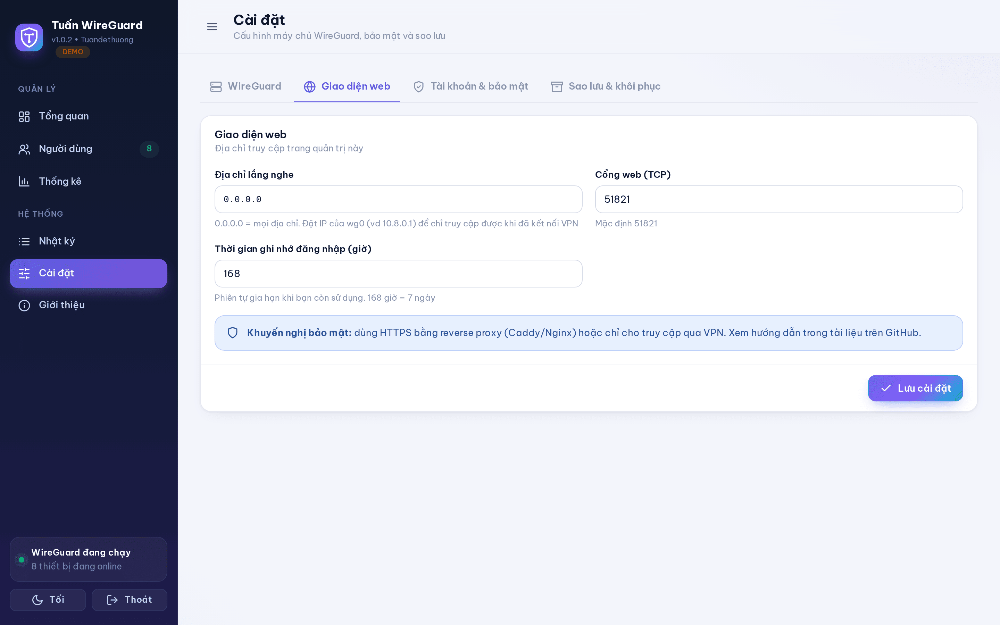</p>

| Trường | Ý nghĩa |
|---|---|
| **Địa chỉ lắng nghe** | `0.0.0.0` = mọi địa chỉ. `127.0.0.1` khi dùng reverse proxy / đường hầm SSH. `10.8.0.1` = chỉ truy cập được khi đã kết nối VPN |
| **Cổng web (TCP)** | Mặc định `51821` |
| **Thời gian ghi nhớ đăng nhập** | Số giờ phiên đăng nhập còn hiệu lực (tự gia hạn khi bạn còn sử dụng). `168` giờ = 7 ngày |

Khi đổi cổng hoặc địa chỉ lắng nghe, dịch vụ web tự khởi động lại và trang tự chuyển sang địa chỉ mới sau vài giây.

### 9.3. Tài khoản và bảo mật

<p align="center">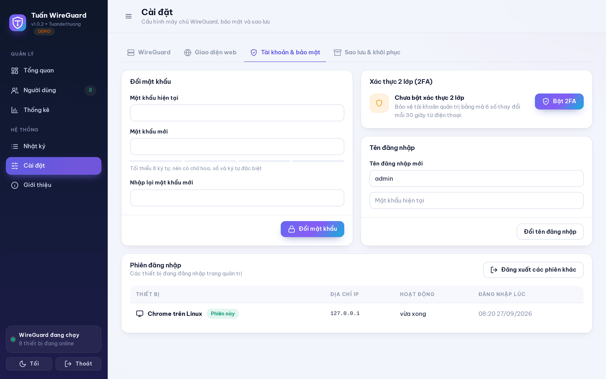</p>

- **Đổi mật khẩu**: nhập mật khẩu hiện tại và mật khẩu mới (tối thiểu 8 ký tự; thanh màu cho biết độ mạnh).
- **Xác thực 2 lớp (2FA)**: bấm **Bật 2FA** → quét mã QR bằng *Google Authenticator*, *Microsoft Authenticator*,
  *Authy*... → nhập mã 6 số để xác nhận. Từ đó mỗi lần đăng nhập cần thêm mã từ điện thoại.
  Mất điện thoại: `sudo tuan-wg reset-2fa` trên máy chủ.
- **Tên đăng nhập**: đổi tên tài khoản quản trị (cần mật khẩu hiện tại).
- **Phiên đăng nhập**: danh sách thiết bị đang đăng nhập (trình duyệt, IP, lần hoạt động). **Đăng xuất các phiên khác**
  khi nghi ngờ lộ mật khẩu hoặc quên đăng xuất ở máy lạ.

### 9.4. Sao lưu và khôi phục

<p align="center">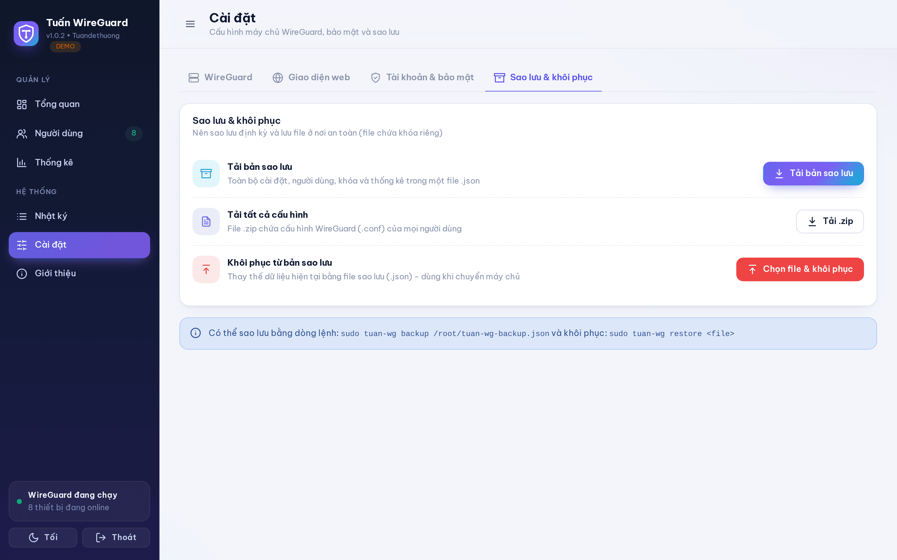</p>

- **Tải bản sao lưu**: một file `.json` chứa toàn bộ cài đặt, người dùng, khóa và thống kê.
- **Tải tất cả cấu hình**: file `.zip` chứa file `.conf` của mọi người dùng.
- **Khôi phục từ bản sao lưu**: thay thế **toàn bộ** dữ liệu hiện tại bằng file sao lưu, WireGuard tự khởi động lại.

> [!CAUTION]
> File sao lưu chứa **khóa riêng của máy chủ và của mọi người dùng**. Cất giữ ở nơi an toàn, không gửi qua kênh công khai.

Quy trình chuyển máy chủ chi tiết: [mục 14](#14-sao-lưu-khôi-phục-và-chuyển-máy-chủ).

---

## 10. Dùng trên điện thoại và chế độ tối

Giao diện tự co giãn theo màn hình. Trên điện thoại, danh sách người dùng hiển thị dạng thẻ, menu nằm sau nút ☰,
hộp thoại trượt lên từ cạnh dưới.

<table>
<tr>
<td width="20%" valign="top">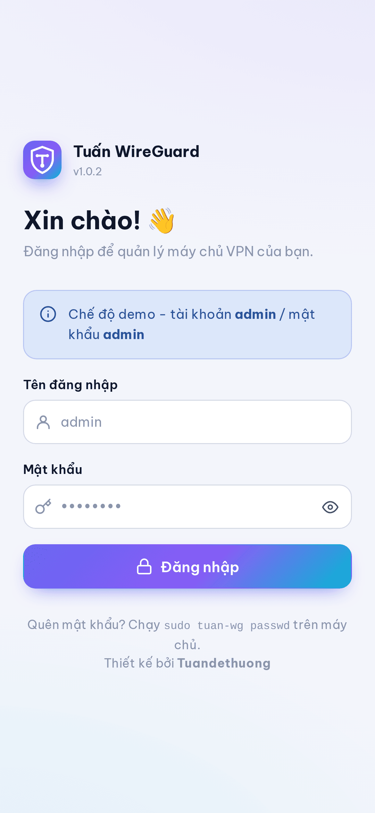<br><sub>Đăng nhập</sub></td>
<td width="20%" valign="top">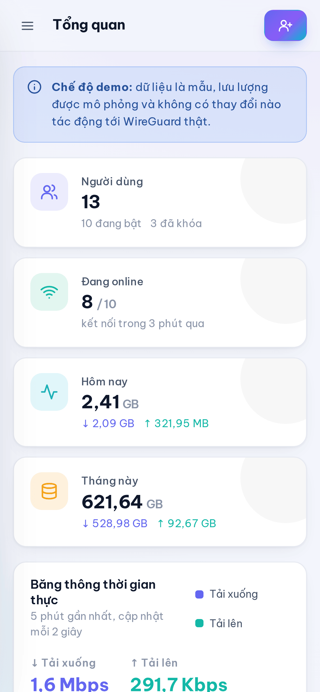<br><sub>Tổng quan</sub></td>
<td width="20%" valign="top">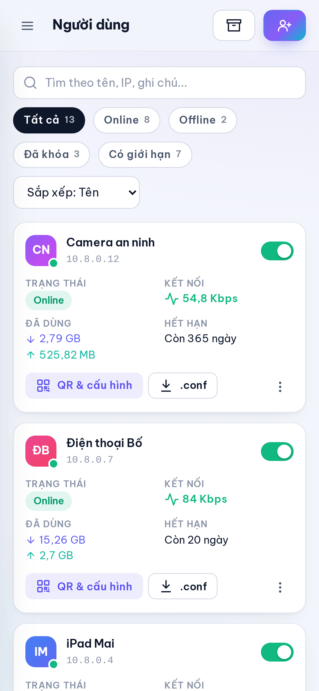<br><sub>Người dùng</sub></td>
<td width="20%" valign="top">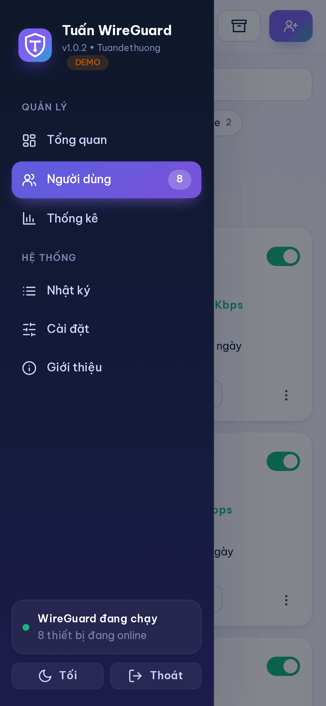<br><sub>Menu</sub></td>
<td width="20%" valign="top">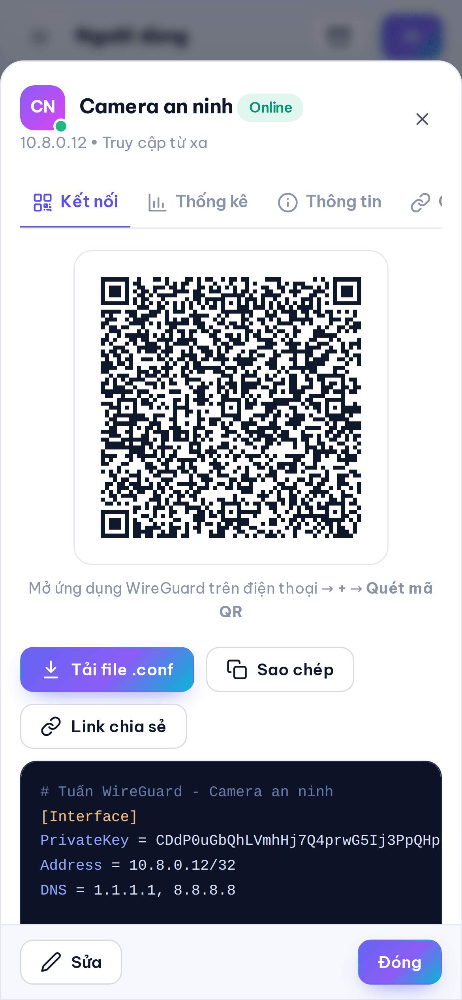<br><sub>Mã QR</sub></td>
</tr>
</table>

**Chế độ tối** tự bật theo cài đặt của hệ điều hành; bấm nút **Tối / Sáng** ở cuối thanh bên để đổi (được ghi nhớ).

<table>
<tr>
<td width="50%" valign="top">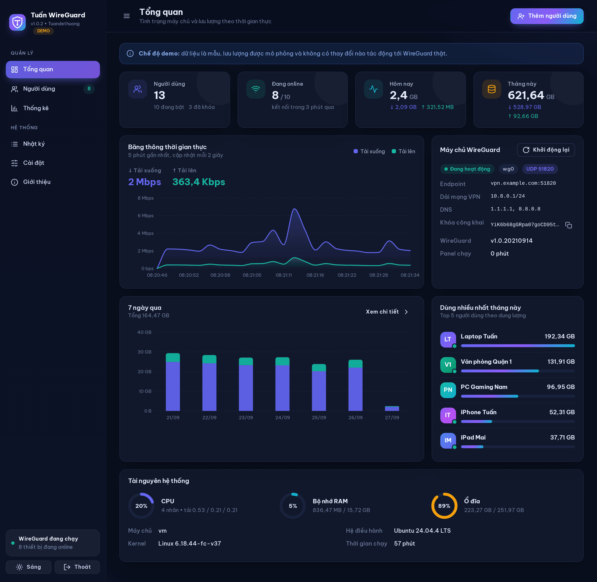</td>
<td width="50%" valign="top">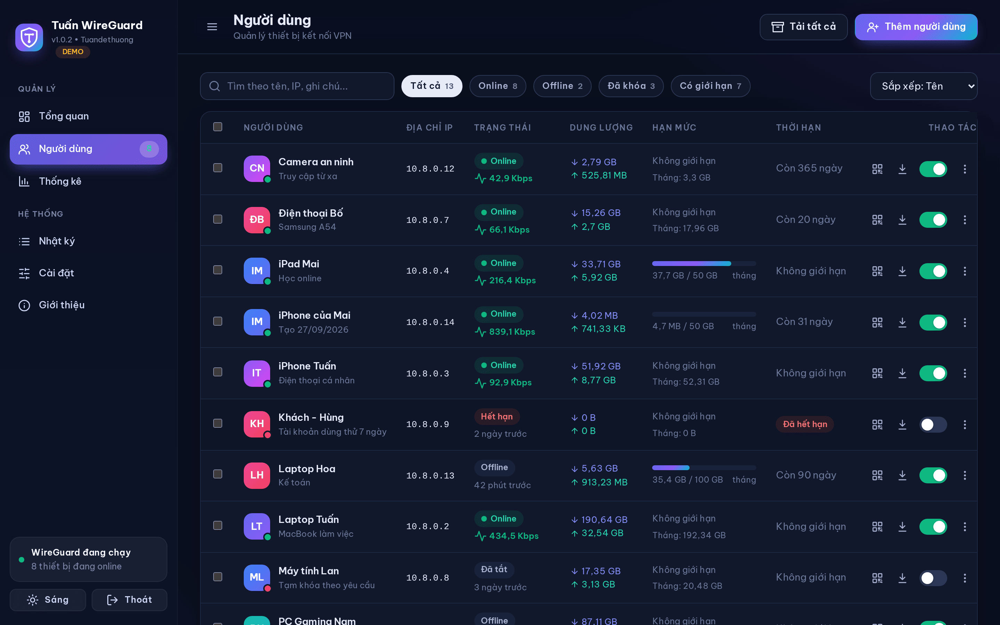</td>
</tr>
</table>

---

## 11. Dòng lệnh

Mọi thao tác chính đều làm được bằng lệnh `tuan-wg` trên máy chủ — tiện khi chưa mở được trang web hoặc khi viết script.
Thay đổi bằng dòng lệnh được áp dụng ngay vào WireGuard và giao diện web tự cập nhật.

<p align="center">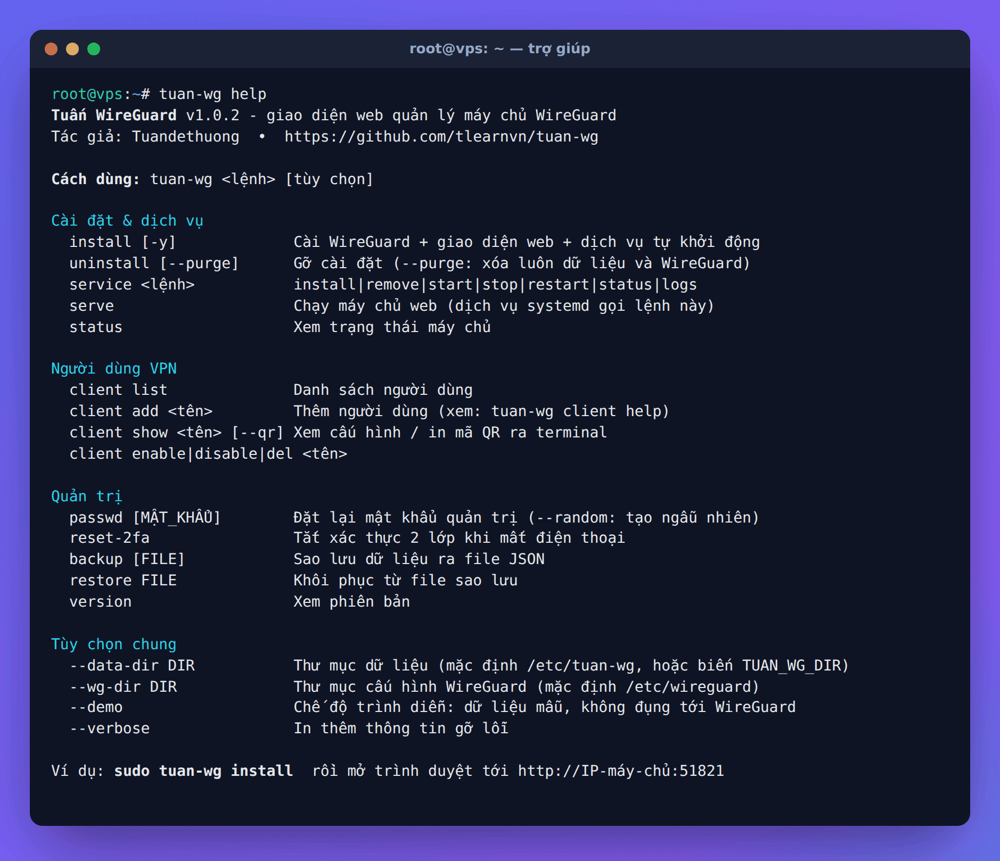</p>

### Người dùng VPN

```bash
sudo tuan-wg client list                                   # danh sách
sudo tuan-wg client add "iPhone của Mai"                   # thêm người dùng
sudo tuan-wg client add "Khách" --expire 7 --limit 10      # hết hạn sau 7 ngày, tối đa 10 GB
sudo tuan-wg client add "Nhân viên A" --limit 50 --monthly --note "Phòng kế toán" --qr
sudo tuan-wg client show "iPhone của Mai" --qr             # xem cấu hình + in mã QR
sudo tuan-wg client config "iPhone của Mai" > mai.conf     # xuất file cấu hình
sudo tuan-wg client qr 10.8.0.2                            # in mã QR (tìm theo tên, id hoặc IP)
sudo tuan-wg client disable "Khách"                        # tắt
sudo tuan-wg client enable "Khách"                         # bật
sudo tuan-wg client del "Khách"                            # xóa
```

| Tùy chọn của `client add` | Ý nghĩa |
|---|---|
| `--note TEXT` | Ghi chú |
| `--expire SỐ_NGÀY` | Hết hạn sau số ngày (bỏ trống = không giới hạn) |
| `--limit GB` | Hạn mức dung lượng (GB) |
| `--monthly` | Hạn mức làm mới đầu mỗi tháng |
| `--dns LIST` | DNS riêng, ví dụ `"1.1.1.1, 1.0.0.1"` |
| `--allowed-ips LIST` | AllowedIPs riêng, ví dụ `"10.8.0.0/24"` (chỉ mạng nội bộ VPN) |
| `--qr` | In mã QR ra terminal ngay sau khi tạo |

<p align="center">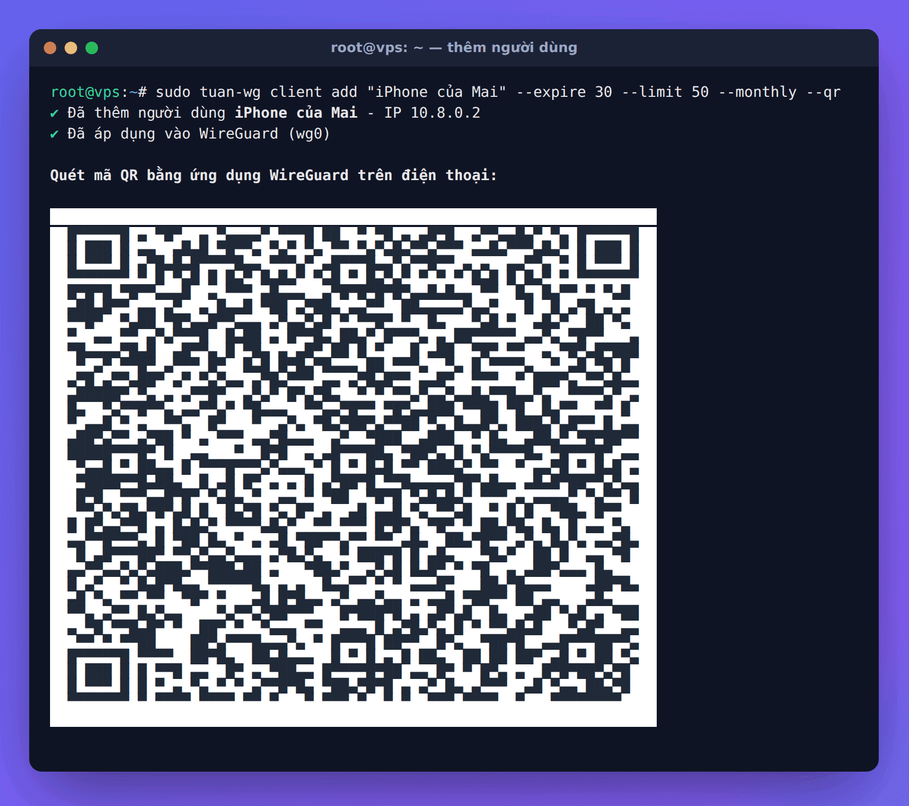</p>

### Quản trị và dịch vụ

| Lệnh | Tác dụng |
|---|---|
| `sudo tuan-wg status` | Trạng thái dịch vụ web, WireGuard, người dùng, địa chỉ truy cập |
| `sudo tuan-wg passwd` | Đặt lại mật khẩu quản trị (hỏi ẩn). `passwd --random` tạo mật khẩu ngẫu nhiên |
| `sudo tuan-wg reset-2fa` | Tắt xác thực 2 lớp |
| `sudo tuan-wg backup [FILE]` | Sao lưu ra file JSON (không có FILE: in ra màn hình) |
| `sudo tuan-wg restore FILE` | Khôi phục từ file sao lưu |
| `sudo tuan-wg service status\|start\|stop\|restart\|logs [-f]` | Quản lý dịch vụ `tuan-wg.service` |
| `sudo tuan-wg service install\|remove\|enable\|disable` | Tạo / gỡ / bật / tắt tự khởi động |
| `sudo tuan-wg install` · `uninstall [--purge] [-y]` | Cài đặt / gỡ cài đặt |
| `tuan-wg version` | Phiên bản |
| `tuan-wg <lệnh> --help` | Hướng dẫn riêng của từng lệnh (không thực thi lệnh) |

Tùy chọn chung: `--data-dir DIR` (thư mục dữ liệu, mặc định `/etc/tuan-wg`, hoặc biến `TUAN_WG_DIR`),
`--wg-dir DIR` (mặc định `/etc/wireguard`), `--verbose`, `--demo`. Đặt biến `NO_COLOR=1` để tắt màu.
Xem thêm: `man tuan-wg` (bản cài bằng `.deb`).

### Ví dụ viết script

```bash
# Tạo hàng loạt người dùng từ file danh sách (mỗi dòng một tên), hạn 30 ngày
while IFS= read -r ten; do
  [ -n "$ten" ] && sudo tuan-wg client add "$ten" --expire 30
done < danh-sach.txt

# Xuất cấu hình của vài người dùng ra file
for ten in "Laptop Tuấn" "iPhone của Mai"; do
  sudo tuan-wg client config "$ten" > "$ten.conf"
done
```

---

## 12. Dịch vụ tự khởi động (systemd)

Trình cài đặt tạo và bật hai dịch vụ, nên sau khi máy chủ khởi động lại mọi thứ **tự chạy** mà không cần thao tác:

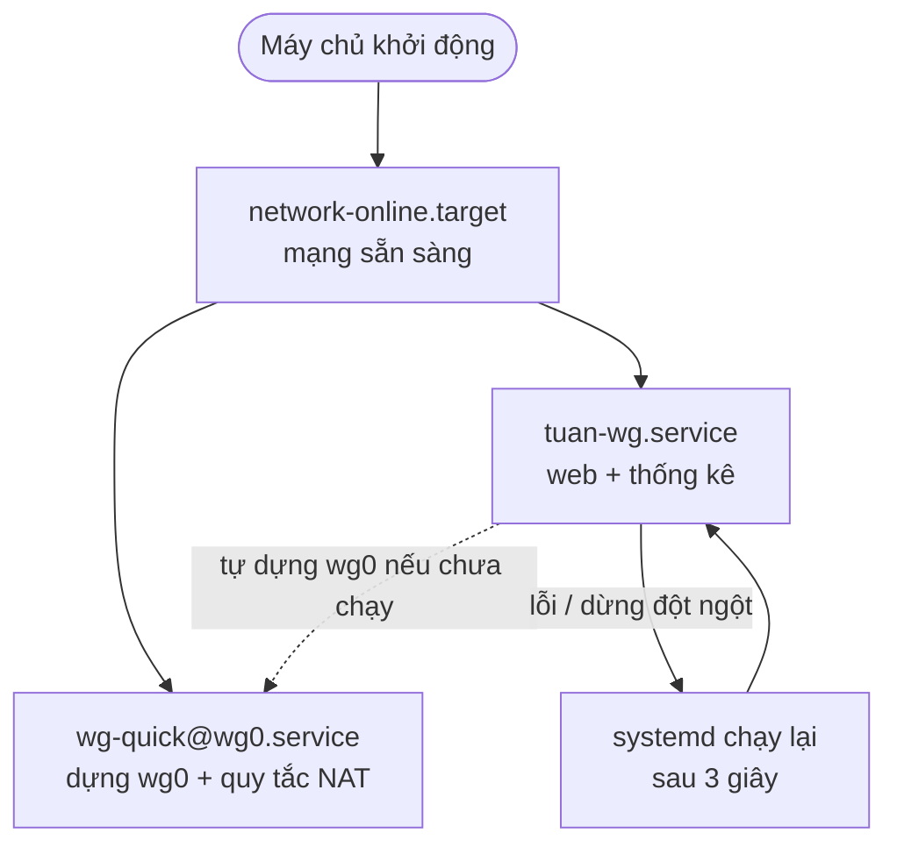
```mermaid
flowchart TD
    boot(["Máy chủ khởi động"]) --> net["network-online.target<br/>mạng sẵn sàng"]
    net --> wgq["wg-quick@wg0.service<br/>dựng wg0 + quy tắc NAT"]
    net --> twg["tuan-wg.service<br/>web + thống kê"]
    twg -. "tự dựng wg0 nếu chưa chạy" .-> wgq
    twg -- "lỗi / dừng đột ngột" --> rs["systemd chạy lại<br/>sau 3 giây"]
    rs --> twg
```

| Dịch vụ | Vai trò |
|---|---|
| `wg-quick@wg0.service` | Đường hầm WireGuard. VPN hoạt động kể cả khi giao diện web dừng |
| `tuan-wg.service` | Giao diện web, REST API, bộ thu thập thống kê, tự khóa hết hạn/hạn mức. `Restart=always` |

```bash
sudo tuan-wg service status            # hoặc: systemctl status tuan-wg
sudo tuan-wg service restart           # khởi động lại giao diện web
sudo tuan-wg service logs -f           # xem log trực tiếp (journalctl -u tuan-wg -f)
systemctl is-enabled tuan-wg wg-quick@wg0   # kiểm tra đã bật tự khởi động: enabled
sudo reboot                             # thử khởi động lại, sau đó: sudo tuan-wg status
```

Nội dung dịch vụ (`/usr/lib/systemd/system/tuan-wg.service` với bản `.deb`, `/etc/systemd/system/tuan-wg.service` với bản khác):

```ini
[Unit]
Description=Tuấn WireGuard - giao diện web quản lý WireGuard
Documentation=https://github.com/tlearnvn/tuan-wg
After=network-online.target
Wants=network-online.target

[Service]
Type=simple
ExecStart=/usr/bin/tuan-wg serve
Restart=always
RestartSec=3
LimitNOFILE=65536
ProtectHome=true
PrivateTmp=true

[Install]
WantedBy=multi-user.target
```

Hệ thống không có systemd (một số container): chạy `tuan-wg serve` bằng trình quản lý tiến trình của bạn
(OpenRC, supervisord, runit...). Lệnh này tự dựng WireGuard nếu chưa chạy.

---

## 13. Bảo mật nâng cao

Mặc định giao diện web chạy **HTTP** trên cổng 51821. Mật khẩu vẫn được băm an toàn trên máy chủ, nhưng khi truy cập qua
Internet bạn nên chọn **một** trong các cách sau:

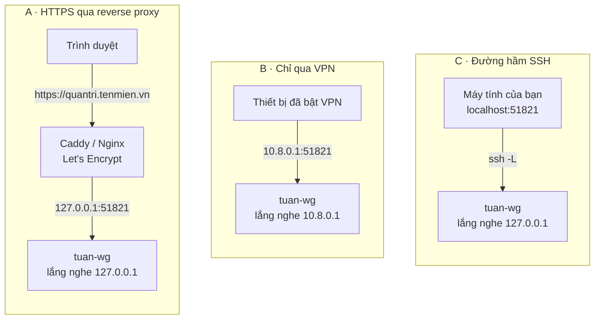
```mermaid
flowchart LR
    subgraph A["A · HTTPS qua reverse proxy"]
        direction TB
        a1["Trình duyệt"] -- "https://quantri.tenmien.vn" --> a2["Caddy / Nginx<br/>Let's Encrypt"]
        a2 -- "127.0.0.1:51821" --> a3["tuan-wg<br/>lắng nghe 127.0.0.1"]
    end
    subgraph B["B · Chỉ qua VPN"]
        direction TB
        b1["Thiết bị đã bật VPN"] -- "10.8.0.1:51821" --> b2["tuan-wg<br/>lắng nghe 10.8.0.1"]
    end
    subgraph C["C · Đường hầm SSH"]
        direction TB
        c1["Máy tính của bạn<br/>localhost:51821"] -- "ssh -L" --> c2["tuan-wg<br/>lắng nghe 127.0.0.1"]
    end
    A ~~~ B ~~~ C
```

### 13.1. HTTPS với Caddy (đơn giản nhất)

Cần một tên miền (ví dụ `quantri.tenmien.vn`) trỏ bản ghi A về IP máy chủ và mở cổng 80, 443/tcp.

```bash
sudo apt install caddy
sudo tee /etc/caddy/Caddyfile >/dev/null <<'EOF'
quantri.tenmien.vn {
    reverse_proxy 127.0.0.1:51821
}
EOF
sudo systemctl reload caddy
```

Caddy tự xin và gia hạn chứng chỉ Let's Encrypt. Mở `https://quantri.tenmien.vn` kiểm tra, sau đó vào
*Cài đặt → Giao diện web* đổi **Địa chỉ lắng nghe** thành `127.0.0.1` để chặn truy cập trực tiếp cổng 51821.
Ứng dụng nhận biết HTTPS qua reverse proxy trên cùng máy chủ và tự thêm cờ `Secure` cho cookie, ghi đúng IP thật của
người truy cập vào nhật ký.

### 13.2. HTTPS với Nginx

```nginx
server {
    listen 443 ssl http2;
    server_name quantri.tenmien.vn;
    ssl_certificate     /etc/letsencrypt/live/quantri.tenmien.vn/fullchain.pem;
    ssl_certificate_key /etc/letsencrypt/live/quantri.tenmien.vn/privkey.pem;

    location / {
        proxy_pass http://127.0.0.1:51821;
        proxy_set_header Host $host;
        proxy_set_header X-Real-IP $remote_addr;
        proxy_set_header X-Forwarded-For $proxy_add_x_forwarded_for;
        proxy_set_header X-Forwarded-Proto $scheme;
    }
}
```

Lấy chứng chỉ bằng `sudo apt install certbot python3-certbot-nginx && sudo certbot --nginx -d quantri.tenmien.vn`.

> [!NOTE]
> Tuấn WireGuard chỉ tin các header `X-Real-IP`, `X-Forwarded-For`, `X-Forwarded-Proto` khi yêu cầu đến từ
> `127.0.0.1` (reverse proxy trên cùng máy) — kẻ xấu không thể giả IP qua header khi truy cập trực tiếp.

### 13.3. Chỉ cho truy cập trang quản trị qua VPN

1. Tạo một người dùng cho chính bạn và kết nối VPN thành công.
2. *Cài đặt → Giao diện web* → **Địa chỉ lắng nghe** = `10.8.0.1` (IP của máy chủ trong VPN) → Lưu.
3. Từ nay mở `http://10.8.0.1:51821` khi đã bật VPN.

Nếu lúc khởi động `wg0` chưa có địa chỉ đó, dịch vụ tạm lắng nghe mọi địa chỉ để bạn không bị khóa ngoài. Muốn chặn tuyệt
đối, kết hợp thêm tường lửa ([13.5](#135-tường-lửa)). Lỡ cấu hình sai: dùng đường hầm SSH ([13.4](#134-đường-hầm-ssh)) để vào sửa lại.

### 13.4. Đường hầm SSH

Không cần mở cổng 51821 ra Internet:

```bash
# chạy trên máy tính của bạn
ssh -L 51821:127.0.0.1:51821 root@IP-máy-chủ
# rồi mở trình duyệt: http://localhost:51821
```

### 13.5. Tường lửa

Ví dụ với `ufw` — chỉ cho IP văn phòng của bạn vào trang quản trị:

```bash
sudo ufw allow 22/tcp                                         # SSH (đừng quên!)
sudo ufw allow 51820/udp                                      # WireGuard
sudo ufw allow from 203.0.113.5 to any port 51821 proto tcp   # trang quản trị, chỉ từ IP này
sudo ufw enable
```

### 13.6. Danh sách kiểm tra

- [ ] Đổi mật khẩu mặc định, dùng mật khẩu dài (≥ 12 ký tự) và **bật 2FA**.
- [ ] Truy cập trang quản trị qua **HTTPS**, VPN hoặc SSH; hạn chế mở `51821/tcp` cho mọi IP.
- [ ] Link chia sẻ: chọn thời hạn ngắn, **thu hồi** khi người dùng đã cài xong.
- [ ] Mất thiết bị / lộ file cấu hình → **Tạo lại khóa** hoặc xóa người dùng đó.
- [ ] Sao lưu định kỳ và cất file sao lưu an toàn (chứa khóa riêng).
- [ ] Thỉnh thoảng xem **Nhật ký** và **Phiên đăng nhập**; cập nhật phiên bản mới.

---

## 14. Sao lưu, khôi phục và chuyển máy chủ

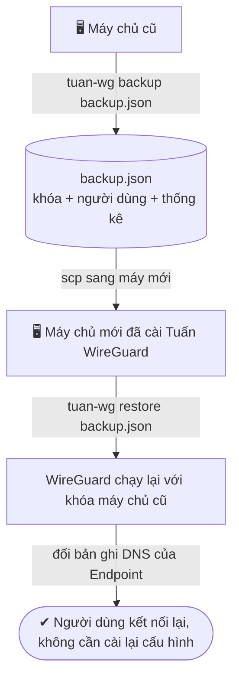
```mermaid
flowchart TD
    old["🖥️ Máy chủ cũ"] -- "tuan-wg backup backup.json" --> file[("backup.json<br/>khóa + người dùng + thống kê")]
    file -- "scp sang máy mới" --> new["🖥️ Máy chủ mới đã cài Tuấn WireGuard"]
    new -- "tuan-wg restore backup.json" --> run["WireGuard chạy lại với khóa máy chủ cũ"]
    run -- "đổi bản ghi DNS của Endpoint" --> done(["✔ Người dùng kết nối lại, không cần cài lại cấu hình"])
```

**Chuyển sang máy chủ mới:**

```bash
# 1. Trên máy chủ cũ
sudo tuan-wg backup /root/tuan-wg-backup.json
scp /root/tuan-wg-backup.json root@IP-MÁY-MỚI:/root/

# 2. Trên máy chủ mới: cài đặt rồi khôi phục
curl -fsSL https://raw.githubusercontent.com/tlearnvn/tuan-wg/HEAD/scripts/install.sh | sudo bash
sudo tuan-wg restore /root/tuan-wg-backup.json
sudo tuan-wg status
```

3. Nếu Endpoint là **tên miền**: đổi bản ghi DNS sang IP mới là xong — thiết bị tự kết nối lại vì khóa máy chủ được giữ nguyên.
   Nếu Endpoint là **IP**: sửa Endpoint trong *Cài đặt → WireGuard* rồi gửi lại cấu hình cho người dùng.
4. Kiểm tra lại **Card mạng WAN** (máy mới có thể là `ens3`, `enp1s0`... thay vì `eth0`) — để trống để tự phát hiện.

**Sao lưu tự động mỗi ngày** (giữ 14 bản gần nhất) — tạo file `/etc/cron.d/tuan-wg-backup`:

```cron
# m h dom mon dow user command
0 3 * * * root /usr/bin/tuan-wg backup /root/tuan-wg-backup-$(date +\%F).json >/dev/null && find /root -name 'tuan-wg-backup-*.json' -mtime +14 -delete
```

(Bản cài từ `.tar.gz` / mã nguồn dùng đường dẫn `/usr/local/bin/tuan-wg`.)

---

## 15. Cập nhật và gỡ cài đặt

### Cập nhật

```bash
# Cách 1: chạy lại lệnh cài một dòng (tải bản mới nhất)
curl -fsSL https://raw.githubusercontent.com/tlearnvn/tuan-wg/HEAD/scripts/install.sh | sudo bash

# Cách 2: cài đè gói .deb mới
sudo apt install ./tuan-wg_1.0.3_amd64.deb

# Cách 3: bản .tar.gz — giải nén bản mới rồi chạy
sudo ./install.sh -y
```

Dữ liệu (người dùng, khóa, thống kê, cài đặt) **được giữ nguyên**, dịch vụ tự khởi động lại với phiên bản mới.
Kiểm tra phiên bản: `tuan-wg version` hoặc trang **Giới thiệu** (có nút **Kiểm tra cập nhật** và lịch sử thay đổi).

<p align="center">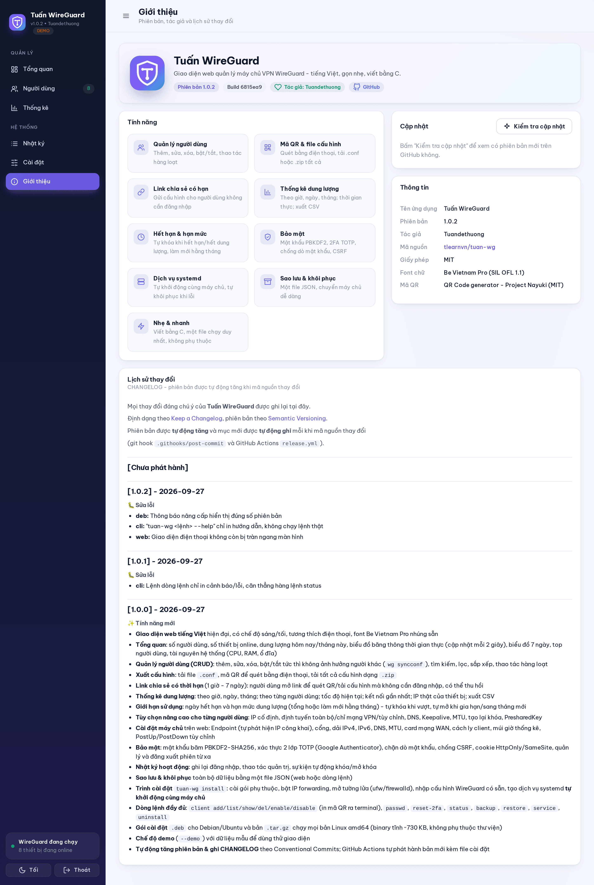</p>

### Gỡ cài đặt

| Lệnh | Kết quả |
|---|---|
| `sudo apt remove tuan-wg` | Gỡ ứng dụng + dịch vụ web. **WireGuard vẫn chạy** với cấu hình hiện tại, dữ liệu giữ ở `/etc/tuan-wg` |
| `sudo apt purge tuan-wg` | Gỡ sạch: dừng WireGuard, xóa `wg0.conf` do ứng dụng tạo, dữ liệu và file sysctl |
| `sudo tuan-wg uninstall` | (bản `.tar.gz` / mã nguồn) Gỡ dịch vụ, giữ dữ liệu và WireGuard |
| `sudo tuan-wg uninstall --purge` | Gỡ sạch như `apt purge` |

---

## 16. Xử lý sự cố và câu hỏi thường gặp

### Không kết nối được VPN

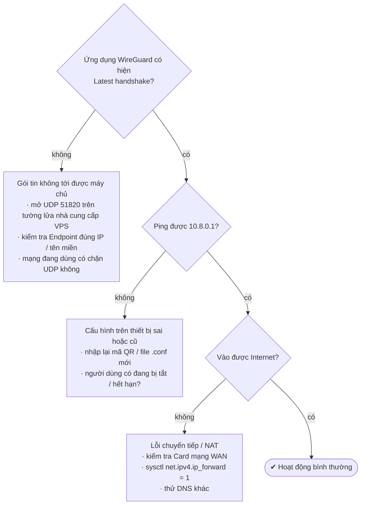
```mermaid
flowchart TD
    q1{"Ứng dụng WireGuard có hiện<br/>Latest handshake?"}
    q1 -- "không" --> a1["Gói tin không tới được máy chủ<br/>· mở UDP 51820 trên tường lửa nhà cung cấp VPS<br/>· kiểm tra Endpoint đúng IP / tên miền<br/>· mạng đang dùng có chặn UDP không"]
    q1 -- "có" --> q2{"Ping được 10.8.0.1?"}
    q2 -- "không" --> a2["Cấu hình trên thiết bị sai hoặc cũ<br/>· nhập lại mã QR / file .conf mới<br/>· người dùng có đang bị tắt / hết hạn?"]
    q2 -- "có" --> q3{"Vào được Internet?"}
    q3 -- "không" --> a3["Lỗi chuyển tiếp / NAT<br/>· kiểm tra Card mạng WAN<br/>· sysctl net.ipv4.ip_forward = 1<br/>· thử DNS khác"]
    q3 -- "có" --> ok(["✔ Hoạt động bình thường"])
```

Các lệnh kiểm tra nhanh trên máy chủ:

```bash
sudo tuan-wg status                                  # tổng quan
sudo wg show                                         # peer nào có "latest handshake"
sysctl net.ipv4.ip_forward                           # phải là 1
sudo iptables -t nat -S | grep MASQUERADE            # phải có quy tắc cho 10.8.0.0/24
ip route show default                                # card mạng WAN thực tế (dev ...)
sudo journalctl -u wg-quick@wg0 -u tuan-wg -n 50     # log gần nhất
```

### Câu hỏi thường gặp

**Quên mật khẩu quản trị?**
Trên máy chủ chạy `sudo tuan-wg passwd` (nhập mật khẩu mới) hoặc `sudo tuan-wg passwd --random`.

**Mất điện thoại có ứng dụng xác thực 2 lớp?**
`sudo tuan-wg reset-2fa`, đăng nhập lại rồi bật 2FA với điện thoại mới.

**Bị báo tạm khóa đăng nhập?**
Sau 5 lần nhập sai trong 15 phút, IP đó bị khóa đăng nhập 15 phút. Chờ hết thời gian, hoặc chạy `sudo systemctl restart tuan-wg` để xóa ngay.

**Không mở được trang quản trị?**
Kiểm tra dịch vụ (`sudo tuan-wg status`), thử trên chính máy chủ: `curl -I http://127.0.0.1:51821`. Nếu trên máy chủ
mở được mà từ ngoài không được → cổng 51821/tcp đang bị chặn bởi tường lửa của nhà cung cấp VPS (hoặc `iptables` mặc định
của một số image như Oracle Cloud: `sudo iptables -I INPUT -p tcp --dport 51821 -j ACCEPT` rồi lưu lại bằng `sudo netfilter-persistent save`). Kiểm tra cả **Địa chỉ lắng nghe**:
`sudo ss -ltnp | grep 51821`.

**Có handshake nhưng không vào được Internet?**
Thường do sai **Card mạng WAN**. Xem card thật bằng `ip route show default` (phần `dev ...`), nhập vào *Cài đặt → WireGuard →
Card mạng WAN* (hoặc để trống để tự phát hiện) rồi lưu. Kiểm tra thêm `net.ipv4.ip_forward = 1`.

**Mạng công ty / trường học chặn VPN?**
Đổi **cổng lắng nghe** sang `443` hoặc `53` (các cổng UDP thường được mở), rồi gửi lại cấu hình cho người dùng.

**Một số trang web tải không hết, ứng dụng hay treo?**
Giảm **MTU** xuống `1380` hoặc `1280` (trong *Cài đặt → WireGuard* hoặc riêng từng người dùng), rồi cập nhật lại cấu hình trên thiết bị.

**WireGuard không khởi động được?**
Xem `sudo journalctl -u wg-quick@wg0 -n 50`. Trên VPS dạng container (OpenVZ, LXC) kernel không có WireGuard — trình cài đặt
tự cài `wireguard-go`; nếu vẫn lỗi, nhà cung cấp cần bật thiết bị TUN (`/dev/net/tun`) cho VPS.

**Người dùng nhập từ cấu hình WireGuard cũ hiện `<không có khóa riêng>`?**
File cấu hình WireGuard của máy chủ không chứa khóa riêng của thiết bị, nên không xuất lại được cấu hình đầy đủ. Thiết bị
cũ vẫn kết nối bình thường. Muốn cấp cấu hình mới: dùng **Tạo lại khóa** rồi gửi mã QR mới.

**Đổi IP máy chủ thì sao?**
Nếu Endpoint là tên miền: chỉ cần đổi bản ghi DNS. Nếu là IP: sửa Endpoint rồi gửi lại cấu hình cho người dùng.

**Tối đa bao nhiêu người dùng?**
Phụ thuộc dải mạng: `/24` → 253, `/22` → 1.021, `/20` trở lên → 4.000 (giới hạn của ứng dụng). VPS nhỏ vẫn chạy tốt với hàng trăm thiết bị.

**Dung lượng thống kê khác số liệu của nhà mạng?**
Ứng dụng đếm byte tại tầng WireGuard trên máy chủ (đã gồm phần mã hóa), nên có thể chênh lệch nhỏ so với nơi khác.

**Có dùng được trên máy ARM (Raspberry Pi, Oracle Ampere)?**
Bản phát hành chính thức là Linux amd64. Mã nguồn C thuần nên có thể tự build trên máy ARM: `make` (hoặc `make static` nếu có musl).

**Sửa tay `/etc/wireguard/wg0.conf` được không?**
Không nên — file được sinh lại mỗi khi có thay đổi. Dùng các trường trong *Cài đặt* (kể cả PostUp/PostDown) thay cho việc sửa tay.

**Xem log ở đâu?**
`sudo tuan-wg service logs -f` (log dịch vụ), trang **Nhật ký** (thao tác quản trị), `sudo journalctl -u wg-quick@wg0` (WireGuard).

---

## 17. Tệp tin và thư mục

| Đường dẫn | Nội dung |
|---|---|
| `/usr/bin/tuan-wg` | Chương trình (bản `.deb`) — bản `.tar.gz` / mã nguồn: `/usr/local/bin/tuan-wg` |
| `/etc/tuan-wg/db.json` | Cài đặt, tài khoản quản trị (mật khẩu đã băm), người dùng, khóa — quyền `0600` |
| `/etc/tuan-wg/stats.json` | Số liệu thống kê |
| `/etc/tuan-wg/audit.log` | Nhật ký hoạt động |
| `/etc/tuan-wg/sessions.json` | Phiên đăng nhập |
| `/etc/wireguard/wg0.conf` | Cấu hình WireGuard do ứng dụng sinh ra (không sửa tay) |
| `/etc/sysctl.d/99-tuan-wg.conf` | Bật chuyển tiếp IP |
| `/usr/lib/systemd/system/tuan-wg.service` | Dịch vụ systemd (bản `.deb`; bản khác: `/etc/systemd/system/`) |
| `/usr/share/man/man1/tuan-wg.1.gz` | Trang hướng dẫn `man tuan-wg` (bản `.deb`) |

Thư mục `/etc/tuan-wg` chỉ root đọc được. Sao lưu thư mục này (hoặc dùng `tuan-wg backup`) là đủ để khôi phục toàn bộ.

---

## 18. REST API

Giao diện web dùng REST API JSON — bạn có thể dùng API để tự động hóa (script, bot Telegram, hệ thống bán hàng...).

- Đăng nhập bằng `POST /api/login` để nhận cookie phiên `twg_sid` (HttpOnly).
- Mọi yêu cầu **thay đổi dữ liệu** (POST, PUT, DELETE) phải có header **`X-TWG: 1`** (chống CSRF).
- Dữ liệu gửi và nhận dạng JSON; lỗi trả về `{"error": "thông báo"}` kèm mã HTTP tương ứng.

```bash
URL=http://127.0.0.1:51821
# Đăng nhập (thêm "otp":"123456" nếu đã bật 2FA)
curl -s -c cj -H 'X-TWG: 1' -H 'Content-Type: application/json' \
     -d '{"username":"admin","password":"MatKhauCuaBan"}' $URL/api/login

# Danh sách người dùng
curl -s -b cj $URL/api/clients

# Tạo người dùng: hạn mức 50 GB/tháng
curl -s -b cj -H 'X-TWG: 1' -H 'Content-Type: application/json' \
     -d '{"name":"Laptop mới","note":"tạo bằng API","data_limit":53687091200,"limit_monthly":true}' \
     $URL/api/clients

# Tải file cấu hình và mã QR (ID lấy từ danh sách)
curl -s -b cj -o laptop.conf $URL/api/clients/ID/config
curl -s -b cj -o laptop.svg  $URL/api/clients/ID/qr.svg

# Tạo link chia sẻ 24 giờ
curl -s -b cj -H 'X-TWG: 1' -H 'Content-Type: application/json' -d '{"hours":24}' $URL/api/clients/ID/share
```

| Phương thức | Đường dẫn | Tác dụng |
|---|---|---|
| GET | `/api/public/info` | Tên, phiên bản ứng dụng (không cần đăng nhập) |
| POST | `/api/login` · `/api/logout` | Đăng nhập (`username`, `password`, `otp`) · đăng xuất |
| GET | `/api/session` | Thông tin phiên hiện tại |
| GET | `/api/dashboard` · `/api/live` | Số liệu trang Tổng quan · băng thông thời gian thực |
| GET · POST | `/api/clients` | Danh sách · tạo người dùng |
| GET · PUT · DELETE | `/api/clients/{id}` | Xem · sửa · xóa người dùng |
| POST | `/api/clients/{id}/reset` · `/rekey` | Đặt lại dung lượng · tạo lại khóa |
| GET | `/api/clients/{id}/config` · `/qr.svg` | File `.conf` · mã QR (SVG) |
| POST | `/api/clients/{id}/share` | Tạo link chia sẻ (`hours`) |
| DELETE | `/api/shares/{token}` | Thu hồi link chia sẻ |
| POST | `/api/clients/bulk` | Hàng loạt: `{"action":"enable\|disable\|reset\|delete","ids":[...]}` |
| GET | `/api/export.zip` | Tất cả cấu hình |
| GET | `/api/stats?range=24h\|7d\|30d\|90d\|12m` | Thống kê |
| GET · PUT | `/api/settings` | Xem · lưu cài đặt |
| GET | `/api/detect-ip` | Phát hiện IP công khai |
| POST | `/api/wireguard/restart` | Khởi động lại WireGuard |
| POST | `/api/account/password` · `/username` | Đổi mật khẩu · tên đăng nhập |
| POST | `/api/account/2fa/setup` · `/enable` · `/disable` | Thiết lập · bật · tắt 2FA |
| GET · POST | `/api/sessions` · `/api/sessions/revoke-others` | Danh sách phiên · đăng xuất phiên khác |
| GET | `/api/logs?limit=100&q=...` | Nhật ký |
| GET · POST | `/api/backup` · `/api/restore` | Sao lưu · khôi phục |
| GET | `/api/share/{token}` · `/config` · `/qr.svg` | Dữ liệu cho trang link chia sẻ (công khai, cần token hợp lệ) |

Các trường chính của người dùng: `name`, `note`, `enabled`, `expires_at` (Unix timestamp, `0` = không giới hạn),
`data_limit` (byte, `0` = không giới hạn), `limit_monthly`, `address`, `allowed_ips`, `dns`, `keepalive`, `mtu`.

---

## 19. Dành cho nhà phát triển

### Build và kiểm thử

```bash
make              # bản phát triển: build/tuan-wg
make static       # bản tĩnh (musl): build/static/tuan-wg
make test         # kiểm thử đơn vị với AddressSanitizer + UndefinedBehaviorSanitizer
make check        # đơn vị + REST API (không cần root)
make demo         # giao diện với dữ liệu mẫu tại http://127.0.0.1:51821 (admin / admin), không đụng WireGuard thật
make deb dist     # gói .deb và .tar.gz trong dist/
sudo tests/e2e_wireguard.sh build/static/tuan-wg   # đầu-cuối với WireGuard thật trong network namespace
```

Kiểm thử giao diện và chụp ảnh tài liệu (cần Playwright + Chromium):

```bash
./build/tuan-wg serve --demo --listen 127.0.0.1 --port 18080 &
node scripts/screenshots.cjs http://127.0.0.1:18080 docs/images   # báo lỗi nếu có lỗi JavaScript hoặc tràn màn hình
```

### Phiên bản tự động và CHANGELOG

Dự án dùng [Semantic Versioning](https://semver.org/lang/vi/) và [Conventional Commits](https://www.conventionalcommits.org/vi/v1.0.0/).
Bật git hook một lần sau khi clone:

```bash
scripts/setup-hooks.sh          # tương đương: git config core.hooksPath .githooks
```

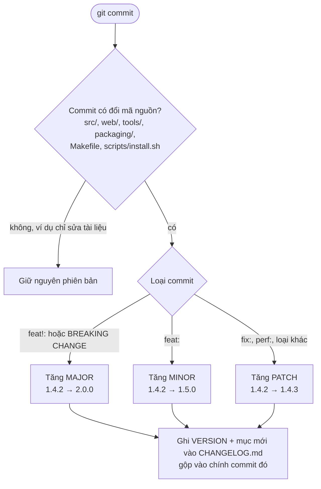
```mermaid
flowchart TD
    c(["git commit"]) --> h{"Commit có đổi mã nguồn?<br/>src/, web/, tools/, packaging/,<br/>Makefile, scripts/install.sh"}
    h -- "không, ví dụ chỉ sửa tài liệu" --> skip["Giữ nguyên phiên bản"]
    h -- "có" --> t{"Loại commit"}
    t -- "feat!: hoặc BREAKING CHANGE" --> ma["Tăng MAJOR<br/>1.4.2 → 2.0.0"]
    t -- "feat:" --> mi["Tăng MINOR<br/>1.4.2 → 1.5.0"]
    t -- "fix:, perf:, loại khác" --> pa["Tăng PATCH<br/>1.4.2 → 1.4.3"]
    ma --> w["Ghi VERSION + mục mới vào CHANGELOG.md<br/>gộp vào chính commit đó"]
    mi --> w
    pa --> w
```

| Tiền tố commit | Mục trong CHANGELOG | Mức tăng |
|---|---|---|
| `feat: ...` | ✨ Tính năng mới | minor |
| `fix: ...` | 🐛 Sửa lỗi | patch |
| `perf: ...` | ⚡ Hiệu năng | patch |
| `refactor: ...` | ♻️ Cải tiến mã nguồn | patch |
| `feat!: ...` hoặc `BREAKING CHANGE:` trong nội dung | 💥 Thay đổi lớn | major |

- Ghi chú viết tay trong mục `## [Chưa phát hành]` của CHANGELOG sẽ được đưa vào phiên bản kế tiếp.
- Tạm tắt hook: `TWG_SKIP_BUMP=1 git commit ...`. Tăng thủ công: `scripts/bump-version.sh [patch|minor|major|X.Y.Z]`
  (xem `--help`: `--range`, `--commit`, `--tag`, `--dry-run`).

### CI và phát hành

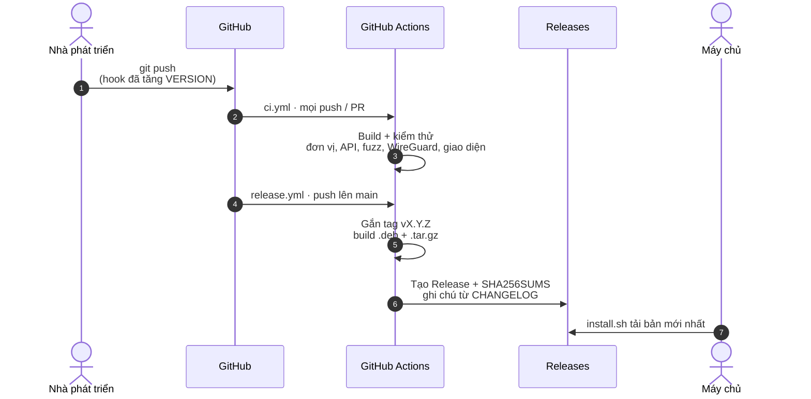
```mermaid
sequenceDiagram
    autonumber
    actor D as Nhà phát triển
    participant G as GitHub
    participant A as GitHub Actions
    participant P as Releases
    actor S as Máy chủ
    D->>G: git push<br/>(hook đã tăng VERSION)
    G->>A: ci.yml · mọi push / PR
    A->>A: Build + kiểm thử<br/>đơn vị, API, fuzz, WireGuard, giao diện
    G->>A: release.yml · push lên main
    A->>A: Gắn tag vX.Y.Z<br/>build .deb + .tar.gz
    A->>P: Tạo Release + SHA256SUMS<br/>ghi chú từ CHANGELOG
    S->>P: install.sh tải bản mới nhất
```

- **`ci.yml`**: chạy cho mọi push / pull request — build, kiểm thử đơn vị (ASan/UBSan), REST API, fuzz HTTP,
  đóng gói, kiểm thử đầu-cuối với WireGuard thật, kiểm thử giao diện bằng Chromium; lưu gói cài đặt làm artifact.
- **`release.yml`**: khi mã nguồn trên `main` thay đổi — nếu `VERSION` chưa có tag thì phát hành đúng phiên bản đó,
  nếu đã có tag thì tự tăng phiên bản; tạo GitHub Release kèm `tuan-wg_X.Y.Z_amd64.deb`,
  `tuan-wg-X.Y.Z-linux-amd64.tar.gz`, bản tên cố định (`tuan-wg_amd64.deb`, `tuan-wg-linux-amd64.tar.gz`) cho
  `scripts/install.sh` và `SHA256SUMS`. Có thể chạy tay (*Run workflow*) và chọn mức tăng.

### Cấu trúc mã nguồn

| File | Chức năng |
|---|---|
| `src/main.c` | Điểm vào, phân tích tham số, lệnh `serve` |
| `src/http.c` | Máy chủ HTTP/1.1 đa luồng, header bảo mật, gzip |
| `src/api.c` | REST API, định tuyến, phân quyền |
| `src/auth.c` | Mật khẩu PBKDF2, phiên, chống dò mật khẩu, TOTP |
| `src/store.c` · `src/app.c` | Dữ liệu `db.json`, kiểm tra hợp lệ, khóa file, tự nạp lại |
| `src/wg.c` | Sinh cấu hình, `wg syncconf`, `wg-quick`, đọc `wg show dump` |
| `src/stats.c` | Bộ thu thập thống kê, hạn mức, tự khóa / mở khóa |
| `src/installer.c` · `src/cli.c` | Trình cài đặt, dịch vụ systemd, các lệnh dòng lệnh |
| `src/crypto.c` · `src/qr.c` · `src/zip.c` · `src/json.c` | SHA-256, HMAC, PBKDF2, X25519, Base64/Base32 · mã QR · file zip · JSON |
| `web/` | Giao diện: `index.html`, `share.html`, `app.css`, `js/pages/*.js` |
| `tools/embed.c` | Nhúng thư mục `web/` (kèm bản gzip) vào binary khi build |

Đóng góp: fork → tạo nhánh → commit theo Conventional Commits → chạy `make check` → mở pull request.

---

<div align="center"><sub>Tuấn WireGuard · giấy phép MIT · © 2026 Tuandethuong · <a href="../README.md">Trang chính</a> · <a href="../CHANGELOG.md">Nhật ký thay đổi</a></sub></div>
